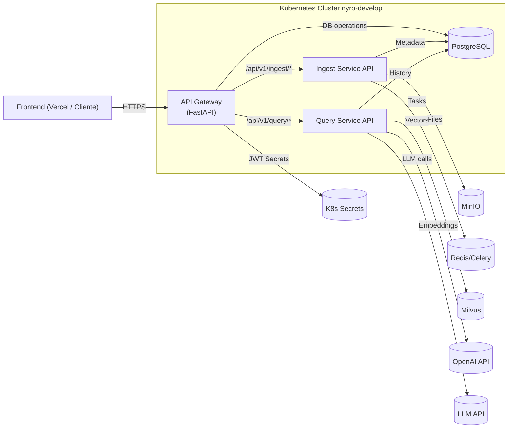

# Documentación de Microservicios


---

## api-gateway

# API Gateway (api-gateway) - Atenex

## 1. Visión General

Este servicio actúa como el **API Gateway** para la plataforma SaaS B2B de Atenex. Es el punto de entrada único y seguro para todas las solicitudes externas destinadas a los microservicios backend (Ingesta, Consulta, etc.) que se ejecutan en el namespace `nyro-develop` de Kubernetes. Sus responsabilidades principales son:

*   **Routing:** Dirige las solicitudes entrantes al microservicio apropiado (`ingest-api-service`, `query-service`) dentro del namespace `nyro-develop`, basándose en la ruta de la URL (`/api/v1/ingest/*`, `/api/v1/query/*`).
*   **Autenticación y Autorización (JWT):**
    *   Verifica los tokens JWT presentados en el header `Authorization: Bearer <token>`.
    *   Valida la **firma** del token usando el secreto compartido (`GATEWAY_JWT_SECRET`).
    *   Valida la **expiración** (`exp`).
    *   Verifica la presencia de **claims requeridos** (`sub`, `exp`).
    *   **Para rutas protegidas estándar:** Extrae y **requiere** el `company_id` directamente del payload del token. Si falta o el usuario no existe/está inactivo en PostgreSQL, la solicitud es rechazada (401 Unauthorized o 403 Forbidden).
    *   **Para asociación inicial:** Proporciona un endpoint (`/api/v1/users/me/ensure-company`) que valida el token pero *no* requiere `company_id` inicialmente, permitiendo asociar uno y generando un *nuevo token* con la asociación.
    *   Proporciona un endpoint (`/api/v1/users/login`) para autenticar usuarios contra PostgreSQL y generar tokens JWT.
*   **Asociación de Compañía (Inicial):**
    *   Provee el endpoint (`POST /api/v1/users/me/ensure-company`) para que usuarios autenticados (sin `company_id` en su token o queriendo cambiarlo) puedan ser asociados a una compañía.
    *   Utiliza conexión directa a **PostgreSQL** (via `asyncpg`) para actualizar el registro del usuario con un `company_id` (ya sea uno proporcionado o el `GATEWAY_DEFAULT_COMPANY_ID`).
*   **Inyección de Headers:** Añade headers críticos a las solicitudes reenviadas a los servicios backend, basados en el payload del token validado:
    *   `X-Company-ID`: Extraído directamente del token.
    *   `X-User-ID`: Extraído del claim `sub` (Subject/User ID).
    *   `X-User-Email`: Extraído del claim `email`.
    *   `X-Request-ID`: Propaga el ID de la solicitud para tracing.
*   **Proxy Inverso:** Reenvía eficientemente las solicitudes (incluyendo cuerpo y query params) a los servicios correspondientes utilizando un cliente HTTP asíncrono (`httpx`).
*   **Centralized CORS:** Gestiona la configuración de Cross-Origin Resource Sharing (CORS) en un solo lugar.
*   **Punto de Observabilidad:** Logging estructurado (JSON), Request ID, Timing.
*   **Manejo de Errores:** Respuestas de error estandarizadas y logging de excepciones.
*   **Health Check:** Endpoint `/health` para verificaciones de estado (Kubernetes probes).

Este Gateway está diseñado para ser ligero y eficiente, enfocándose en la seguridad y el enrutamiento, y delegando la lógica de negocio a los microservicios correspondientes, pero también manejando la autenticación inicial y la lógica de asociación de compañía.

## 2. Arquitectura General del Proyecto (Posición del Gateway)



*Diagrama actualizado para reflejar PostgreSQL en el clúster y el flujo de autenticación/JWT.*

## 3. Características Clave

*   **Proxy Inverso Asíncrono:** Reenvía tráfico a `ingest-api-service` y `query-service` usando `httpx`.
*   **Autenticación y Generación JWT Interna:**
    *   Endpoint `/api/v1/users/login` para autenticar usuarios contra **PostgreSQL** (`asyncpg`, `passlib`) y generar tokens JWT (`python-jose`).
    *   Verifica tokens JWT (`python-jose`). Valida firma, expiración, claims requeridos (`sub`, `exp`). Verifica existencia/estado del usuario en **PostgreSQL**. **Requiere `company_id` en el payload del token para rutas estándar.**
*   **Asociación Inicial de Compañía:** Endpoint dedicado (`/api/v1/users/me/ensure-company`) que valida el token *sin* requerir `company_id` preexistente y usa el cliente **PostgreSQL** para actualizar el registro del usuario. Devuelve un **nuevo token JWT** con la `company_id` actualizada.
*   **Inyección de Headers de Contexto:** Añade `X-Company-ID`, `X-User-ID`, `X-User-Email` a las solicitudes downstream.
*   **Routing basado en Path:** Usa FastAPI para dirigir `/api/v1/ingest/*`, `/api/v1/query/*`, y `/api/v1/users/*`.
*   **Autenticación por Ruta:** Utiliza dependencias (`StrictAuth`, `InitialAuth`) de FastAPI para proteger rutas con diferentes requisitos.
*   **Cliente HTTP Asíncrono Reutilizable:** Gestiona un pool de conexiones `httpx` (inicializado en `lifespan`).
*   **Pool de Conexiones PostgreSQL Asíncrono:** Gestiona conexiones a PostgreSQL usando `asyncpg` (inicializado en `lifespan`).
*   **Logging Estructurado (JSON):** Logs detallados con `structlog`.
*   **Configuración Centralizada:** Carga configuración desde variables de entorno (`pydantic-settings`), prefijo `GATEWAY_`. **Incluye verificaciones críticas para secretos (JWT y PostgreSQL Password).**
*   **Middleware:** CORS, Request ID, Timing, Logging.
*   **Manejo de Errores:** Handlers globales y respuestas estandarizadas.
*   **Despliegue Contenerizado:** Dockerfile y manifests K8s listos.
*   **Health Check:** Endpoint `/health` para probes de K8s.
*   **(Opcional) Proxy de Autenticación:** Ruta `/api/v1/auth/*` si `GATEWAY_AUTH_SERVICE_URL` está configurado.

## 4. Pila Tecnológica Principal

*   **Lenguaje:** Python 3.10+
*   **Framework API:** FastAPI
*   **Cliente HTTP:** HTTPX
*   **Validación/Generación JWT:** python-jose[cryptography]
*   **Hashing Contraseñas:** passlib[bcrypt]
*   **Base de datos (Cliente):** PostgreSQL (via asyncpg)
*   **Configuración:** pydantic-settings
*   **Logging:** structlog
*   **Despliegue:** Docker, Kubernetes, Gunicorn + Uvicorn

## 5. Estructura de la Codebase

```
api-gateway/
├── app/
│   ├── __init__.py
│   ├── auth/                 # Lógica de autenticación y JWT
│   │   ├── __init__.py
│   │   ├── auth_middleware.py # Dependencias (StrictAuth, InitialAuth)
│   │   └── auth_service.py    # Lógica (verify_token, create_token, authenticate_user)
│   ├── core/                 # Configuración y Logging Core
│   │   ├── __init__.py
│   │   ├── config.py         # Settings (Pydantic)
│   │   └── logging_config.py # Configuración structlog
│   ├── db/                   # Lógica de acceso a Base de Datos
│   │   └── postgres_client.py # Funciones asyncpg (get_user, update_user, pool)
│   ├── main.py               # Entrypoint FastAPI, lifespan, middlewares, health
│   ├── routers/              # Definición de rutas
│   │   ├── __init__.py
│   │   ├── auth_router.py    # (Inactivo/Placeholder)
│   │   ├── gateway_router.py # Rutas proxy (/ingest, /query, /auth [opcional])
│   │   └── user_router.py    # Rutas de usuario (/login, /users/me/ensure-company)
│   └── utils/                # (Vacío por ahora)
├── k8s/                      # Manifests de Kubernetes
│   ├── gateway-configmap.yaml
│   ├── gateway-deployment.yaml
│   ├── gateway-secret.example.yaml # Ejemplo, NO incluir valores reales
│   └── gateway-service.yaml
│   # (Deberías tener también los manifests de PostgreSQL aquí o en otro lugar)
├── Dockerfile                # Define cómo construir la imagen Docker
├── pyproject.toml            # Dependencias (Poetry)
├── poetry.lock               # Lockfile de dependencias
└── README.md                 # Este archivo
```
*(Se eliminó `app/auth/jwt_handler.py` ya que su lógica se movió a `auth_service.py`)*

## 6. Configuración

Configuración mediante variables de entorno (prefijo `GATEWAY_`).

**Variables de Entorno Clave:**

| Variable                                | Descripción                                                                      | Ejemplo (Valor Esperado en K8s - ns: `nyro-develop`)            | Gestionado por |
| :-------------------------------------- | :------------------------------------------------------------------------------- | :--------------------------------------------------------------- | :------------- |
| `GATEWAY_LOG_LEVEL`                     | Nivel de logging (DEBUG, INFO, WARNING, ERROR).                                  | `INFO`                                                           | ConfigMap      |
| `GATEWAY_INGEST_SERVICE_URL`            | URL base del Ingest Service API.                                                 | `http://ingest-api-service.nyro-develop.svc.cluster.local:80`  | ConfigMap      |
| `GATEWAY_QUERY_SERVICE_URL`             | URL base del Query Service API.                                                  | `http://query-service.nyro-develop.svc.cluster.local:80`     | ConfigMap      |
| `GATEWAY_AUTH_SERVICE_URL`              | (Opcional) URL base del Auth Service para proxy directo.                           | `http://auth-service.nyro-develop.svc.cluster.local:80`      | ConfigMap      |
| **`GATEWAY_JWT_SECRET`**                | **Clave secreta JWT para firma y validación de tokens.**                           | *Valor secreto en el entorno*                                  | **Secret**     |
| `GATEWAY_JWT_ALGORITHM`                 | Algoritmo usado para los tokens JWT (debe coincidir con `auth_service.py`).        | `HS256`                                                          | ConfigMap      |
| **`GATEWAY_POSTGRES_PASSWORD`**         | **Contraseña para el usuario PostgreSQL.**                                         | *Valor secreto en el entorno*                                  | **Secret**     |
| `GATEWAY_POSTGRES_USER`                 | Usuario para conectar a PostgreSQL.                                              | `postgres` (o el que uses)                                       | ConfigMap      |
| `GATEWAY_POSTGRES_SERVER`               | Host/Service name del servidor PostgreSQL en K8s.                                | `postgresql.nyro-develop.svc.cluster.local`                    | ConfigMap      |
| `GATEWAY_POSTGRES_PORT`                 | Puerto del servidor PostgreSQL.                                                  | `5432`                                                           | ConfigMap      |
| `GATEWAY_POSTGRES_DB`                   | Nombre de la base de datos PostgreSQL.                                           | `atenex` (o la que uses)                                         | ConfigMap      |
| `GATEWAY_DEFAULT_COMPANY_ID`            | UUID de la compañía por defecto a asignar si falta y no se especifica.           | *UUID válido de una compañía* o vacío                            | ConfigMap      |
| `GATEWAY_HTTP_CLIENT_TIMEOUT`           | Timeout (segundos) para llamadas HTTP downstream.                                | `60`                                                             | ConfigMap      |
| `GATEWAY_HTTP_CLIENT_MAX_CONNECTIONS`   | Máximo número total de conexiones HTTP salientes.                                | `200`                                                            | ConfigMap      |
| `GATEWAY_HTTP_CLIENT_MAX_KEEPALIVE_CONNECTIONS` | Máximo número de conexiones HTTP keep-alive.                             | `100`                                                            | ConfigMap      |
| `VERCEL_FRONTEND_URL`                   | (Opcional) URL del frontend Vercel para CORS.                                    | `https://atenex-frontend.vercel.app`                           | ConfigMap/Env  |
| `PORT`                                  | Puerto interno del contenedor (Gunicorn/Uvicorn).                                | `8080`                                                           | Dockerfile/Deployment |

**¡ADVERTENCIAS DE SEGURIDAD IMPORTANTES!**

*   **`GATEWAY_JWT_SECRET`:** Debe ser una clave secreta fuerte y única. Gestionar vía K8s Secret (`atenex-api-gateway-secrets`).
*   **`GATEWAY_POSTGRES_PASSWORD`:** Contraseña de la base de datos. Gestionar vía K8s Secret (`atenex-api-gateway-secrets`).
*   **`GATEWAY_DEFAULT_COMPANY_ID`:** Si se establece, debe ser un UUID válido correspondiente a una compañía real en tu tabla `COMPANIES`.

**Kubernetes (Namespace: `nyro-develop`):**

*   Configuración general -> `atenex-api-gateway-config` (ConfigMap).
*   Secretos (`GATEWAY_JWT_SECRET`, `GATEWAY_POSTGRES_PASSWORD`) -> `atenex-api-gateway-secrets` (Secret).
*   Ambos deben existir en el namespace `nyro-develop`.

## 7. Flujo de Autenticación y Asociación de Compañía

Este Gateway implementa flujos clave basados en JWT y PostgreSQL:

**A) Login (`POST /api/v1/users/login`):**

1.  **Solicitud del Cliente:** Frontend envía `email` y `password`.
2.  **Recepción y Autenticación:** Gateway recibe la solicitud. El endpoint llama a `authenticate_user` (`auth_service.py`).
3.  **Verificación DB:** `authenticate_user` llama a `get_user_by_email` (`postgres_client.py`) para buscar al usuario.
4.  **Verificación Contraseña:** Si el usuario existe y está activo, `authenticate_user` usa `verify_password` (`passlib`) para comparar el hash de la contraseña.
5.  **Generación JWT:** Si las credenciales son válidas, `login_for_access_token` llama a `create_access_token` (`auth_service.py`) para generar un JWT. El token incluye `sub` (user ID), `email`, `exp`, `iat`, y `company_id` (si el usuario ya tiene uno en la DB).
6.  **Respuesta:** El gateway devuelve el `access_token` y datos básicos del usuario.

**B) Validación Estándar (Rutas Protegidas como `/ingest`, `/query`):**

1.  **Solicitud del Cliente:** Frontend envía request con `Authorization: Bearer <token_con_company_id>`.
2.  **Recepción y Extracción:** Gateway recibe la solicitud. La dependencia `StrictAuth` (`auth_middleware.py`) se activa.
3.  **Validación del Token (`verify_token` con `require_company_id=True`):**
    *   Verifica firma, expiración, claims (`sub`, `exp`).
    *   Busca y **requiere** `company_id` directamente en el payload del token. Si falta -> **403 Forbidden**.
    *   Verifica que el usuario (`sub`) exista y esté activo en **PostgreSQL** (llama a `get_user_by_id`). Si no existe/inactivo -> **401 Unauthorized**.
    *   Si todo OK, devuelve el payload (incluyendo `company_id`).
4.  **Inyección y Proxy:** El router (`gateway_router.py`) extrae `X-User-ID`, `X-Company-ID`, `X-User-Email` del payload y los inyecta en la solicitud antes de reenviarla al servicio backend correspondiente.

**C) Asociación/Confirmación de Compañía (`POST /api/v1/users/me/ensure-company`):**

1.  **Contexto:** El frontend (después del login) necesita asegurar que el usuario esté asociado a una compañía (o quiere cambiarla opcionalmente).
2.  **Solicitud del Cliente:** Frontend envía `POST /api/v1/users/me/ensure-company` con el token JWT actual (puede o no tener `company_id`). Opcionalmente, puede incluir `{ "company_id": "uuid-a-asignar" }` en el body.
3.  **Recepción y Extracción:** Gateway recibe la solicitud. La dependencia `InitialAuth` (`auth_middleware.py`) se activa.
4.  **Validación del Token (`verify_token` con `require_company_id=False`):**
    *   Verifica firma, expiración, claims (`sub`, `exp`). Verifica existencia/estado del usuario en **PostgreSQL**.
    *   **NO requiere** `company_id` en el token. Si el token es válido por lo demás, devuelve el payload.
5.  **Lógica del Endpoint (`ensure_company_association` en `user_router.py`):**
    *   Obtiene el `user_id` (`sub`) del payload.
    *   Obtiene datos actuales del usuario de PostgreSQL.
    *   Determina el `company_id` a asignar:
        *   Prioridad 1: El `company_id` del body (si se proporcionó).
        *   Prioridad 2: El `GATEWAY_DEFAULT_COMPANY_ID` (si el usuario no tiene uno y no se proporcionó en el body).
        *   Prioridad 3: La `company_id` actual del usuario (si ya tiene una y no se proporcionó otra).
        *   Error si ninguna de las anteriores aplica.
    *   Si el `company_id` determinado es diferente al actual del usuario, llama a `update_user_company` (`postgres_client.py`) para actualizar la base de datos.
    *   Llama a `create_access_token` para generar un **NUEVO token JWT** que incluya la `company_id` final.
6.  **Respuesta al Cliente:** Devuelve 200 OK con un mensaje, los IDs y el **nuevo token JWT**.
7.  **Acción Frontend:** El frontend **debe** almacenar y usar este **nuevo token** para futuras llamadas, ya que ahora contiene la `company_id` correcta.

## 8. API Endpoints

*   **`GET /`**
    *   **Descripción:** Endpoint raíz.
    *   **Autenticación:** No requerida.
    *   **Respuesta:** `{"message": "Atenex API Gateway is running!"}`

*   **`GET /health`**
    *   **Descripción:** Health Check (K8s probes).
    *   **Autenticación:** No requerida.
    *   **Respuesta OK (200):** `{"status": "healthy", "service": "Atenex API Gateway"}`
    *   **Respuesta Error (503):** (Si se implementa chequeo de dependencias) Si alguna dependencia crítica no está lista.

*   **`POST /api/v1/users/login`**
    *   **Descripción:** Autentica al usuario con email/password contra PostgreSQL.
    *   **Autenticación:** No requerida (se envían credenciales en el body).
    *   **Cuerpo (Request):** `{ "email": "user@example.com", "password": "user_password" }`
    *   **Respuesta OK (200):** `LoginResponse` (incluye `access_token`, `user_id`, `email`, `company_id` si existe).
    *   **Respuesta Error:** 401 (Credenciales inválidas/usuario inactivo).

*   **`POST /api/v1/users/me/ensure-company`**
    *   **Descripción:** Asocia/Confirma una `company_id` para el usuario autenticado. Usa `company_id` del body o la default. Actualiza la DB y genera un nuevo token.
    *   **Autenticación:** **Requerida (InitialAuth).** Token JWT válido (firma, exp, usuario existe), pero **no** requiere `company_id` preexistente en el *token de entrada*.
    *   **Cuerpo (Request Opcional):** `{ "company_id": "uuid-de-compania-especifica" }`
    *   **Respuesta OK (200):** `EnsureCompanyResponse` (incluye `user_id`, `company_id` final, mensaje, y `new_access_token`).
    *   **Respuesta Error:** 400 (Falta `company_id` si es necesario y no hay default), 401 (Token inválido/ausente), 403 (No debería ocurrir aquí), 404 (Usuario del token no en DB), 500 (Error DB o al generar token).

*   **`/api/v1/ingest/{endpoint_path:path}` (Proxy genérico)**
    *   **Métodos:** `GET`, `POST`, `PUT`, `DELETE`, `PATCH`, `OPTIONS`
    *   **Descripción:** Reenvía solicitudes a Ingest Service (`ingest-api-service.nyro-develop.svc.cluster.local:80`).
    *   **Autenticación:** **Requerida (StrictAuth).** Inyecta `X-Company-ID` y `X-User-ID`.

### Ingest Service Proxy - Document State & Retry
*   **GET `/api/v1/ingest/status/{document_id}`**
    *   **Descripción:** Proxy al endpoint de estado individual de Ingest Service.
    *   **Headers:** `X-Company-ID` (UUID) requerido.
    *   **Respuesta (`200 OK`):** JSON con campos:
        ```json
        {
          "document_id": "uuid",
          "status": "processed|processing|uploaded|error",
          "file_name": "...",
          "file_type": "...",
          "chunk_count": 123,            // Valor en PostgreSQL
          "minio_exists": true,          // Flag real en MinIO
          "milvus_chunk_count": 120,     // Conteo real en Milvus
          "last_updated": "2025-...Z",
          "message": "..."            // Mensaje descriptivo
        }
        ```
*   **GET `/api/v1/ingest/status`**
    *   **Descripción:** Proxy al listado paginado de estados en Ingest Service.
    *   **Headers:** `X-Company-ID` (UUID) requerido.
    *   **Query Params:** `limit`, `offset`.
    *   **Respuesta (`200 OK`):** Lista de objetos con al menos `document_id`, `status`, `chunk_count`, `minio_exists`.
*   **POST `/api/v1/ingest/retry/{document_id}`**
    *   **Descripción:** Reintenta la ingesta de un documento en estado `error`.
    *   **Headers:** `X-Company-ID`, `X-User-ID` (UUID) requeridos.
    *   **Respuesta (`202 Accepted`):** JSON:
        ```json
        {
          "document_id": "uuid",
          "task_id": "uuid-celery",
          "status": "processing",
          "message": "Reintento de ingesta encolado correctamente."
        }
        ```

*   **`/api/v1/query/{path:path}` (Proxy Específico y Rutas Relacionadas)**
    *   **Ejemplos:** `/api/v1/query/chats`, `/api/v1/query`, `/api/v1/query/chats/{chat_id}/messages`
    *   **Métodos:** `GET`, `POST`, `DELETE`, `OPTIONS` (según ruta específica)
    *   **Descripción:** Reenvía al `Query Service` (`query-service.nyro-develop...`).
    *   **Autenticación:** **Requerida (StrictAuth).**
    *   **Headers Inyectados:** `X-Company-ID`, `X-User-ID`, `X-User-Email`, `X-Request-ID`.

*   **`/api/v1/auth/{endpoint_path:path}` (Proxy Opcional)**
    *   **Métodos:** Todos
    *   **Descripción:** (Si `GATEWAY_AUTH_SERVICE_URL` está configurado) Reenvía al servicio de autenticación externo.
    *   **Autenticación:** **No requerida por el Gateway.**
    *   **Headers Inyectados:** Ninguno (aparte de los `X-Forwarded-*`).
    *   **Si no está configurado:** Devuelve `404 Not Found`.

## 9. Ejecución Local (Desarrollo)

1.  Instalar Poetry.
2.  Clonar repo, `cd api-gateway`.
3.  `poetry install`
4.  Crear archivo `.env` en `api-gateway/` con variables **locales**:
    ```dotenv
    # api-gateway/.env

    GATEWAY_LOG_LEVEL=DEBUG

    # URLs de servicios locales (ajustar puertos si es necesario)
    GATEWAY_INGEST_SERVICE_URL="http://localhost:8001" # O URL del servicio ingest local
    GATEWAY_QUERY_SERVICE_URL="http://localhost:8002" # O URL del servicio query local
    # GATEWAY_AUTH_SERVICE_URL="http://localhost:8000" # Si tienes un servicio de auth local

    # --- Configuración JWT (¡IMPORTANTE!) ---
    # Usa una clave secreta fuerte para desarrollo, pero NO la de producción
    GATEWAY_JWT_SECRET="una-clave-secreta-muy-fuerte-para-desarrollo-local-1234567890"
    GATEWAY_JWT_ALGORITHM="HS256"

    # --- Configuración PostgreSQL Local (¡IMPORTANTE!) ---
    # Asume que tienes PostgreSQL corriendo localmente (quizás en Docker)
    GATEWAY_POSTGRES_USER="postgres" # Usuario de tu PG local
    GATEWAY_POSTGRES_PASSWORD="tu_password_de_pg_local" # <-- TU CONTRASEÑA LOCAL
    GATEWAY_POSTGRES_SERVER="localhost" # O la IP/hostname de tu contenedor PG
    GATEWAY_POSTGRES_PORT=5432
    GATEWAY_POSTGRES_DB="atenex" # Nombre de la DB local

    # ID de Compañía por defecto (Necesitas crear esta compañía en tu DB local)
    GATEWAY_DEFAULT_COMPANY_ID="un-uuid-valido-de-compania-en-tu-db-local" # <-- UUID VÁLIDO LOCAL

    # HTTP Client (Opcional)
    GATEWAY_HTTP_CLIENT_TIMEOUT=60
    GATEWAY_HTTP_CLIENT_MAX_CONNECTIONS=100
    GATEWAY_HTTP_CLIENT_MAX_KEEPALIVE_CONNECTIONS=20

    # CORS (Opcional para desarrollo local)
    VERCEL_FRONTEND_URL="http://localhost:3000"
    # NGROK_URL="https://<id>.ngrok-free.app"
    ```
5.  Asegúrate de que tu PostgreSQL local esté corriendo, tenga la base de datos `atenex`, el usuario `postgres` (o el que configures) con la contraseña correcta, y las tablas definidas en el esquema. Asegúrate de insertar al menos una compañía con el UUID que pusiste en `GATEWAY_DEFAULT_COMPANY_ID`.
6.  Ejecutar Uvicorn con reload:
    ```bash
    poetry run uvicorn app.main:app --host 0.0.0.0 --port 8080 --reload
    ```
7.  Gateway disponible en `http://localhost:8080`.

## 10. Despliegue

*   **Docker:**
    1.  `docker build -t ghcr.io/tu-org/atenex-api-gateway:$(git rev-parse --short HEAD) .` (Ejemplo de tag con hash git)
    2.  `docker push ghcr.io/tu-org/atenex-api-gateway:$(git rev-parse --short HEAD)`

*   **Kubernetes (Namespace: `nyro-develop`):**
    1.  Asegurar namespace `nyro-develop` existe: `kubectl create namespace nyro-develop` (si no existe).
    2.  **Crear/Actualizar Secretos:** Crear `atenex-api-gateway-secrets` en `nyro-develop` con los valores **reales** de producción para `GATEWAY_JWT_SECRET` y `GATEWAY_POSTGRES_PASSWORD`. **¡NO COMMITEAR VALORES REALES!**
        ```bash
        kubectl create secret generic atenex-api-gateway-secrets \
          --namespace nyro-develop \
          --from-literal=GATEWAY_JWT_SECRET='TU_CLAVE_SECRETA_JWT_DE_PRODUCCION_MUY_SEGURA' \
          --from-literal=GATEWAY_POSTGRES_PASSWORD='LA_CONTRASEÑA_REAL_DE_POSTGRES_EN_PRODUCCION' \
          --dry-run=client -o yaml | kubectl apply -f -
        ```
        *(Reemplaza los placeholders con tus claves reales)*
    3.  **Aplicar Manifests:**
        ```bash
        # Asegúrate que configmap.yaml tenga las URLs correctas y GATEWAY_DEFAULT_COMPANY_ID válido
        kubectl apply -f k8s/gateway-configmap.yaml -n nyro-develop
        # El secreto ya fue creado/actualizado
        # Asegúrate que deployment.yaml tiene la imagen correcta (tu CI/CD debería hacer esto)
        kubectl apply -f k8s/gateway-deployment.yaml -n nyro-develop
        kubectl apply -f k8s/gateway-service.yaml -n nyro-develop
        ```
    4.  Verificar pods (`kubectl get pods -n nyro-develop`), servicio (`kubectl get svc -n nyro-develop`) y logs (`kubectl logs -f <pod-name> -n nyro-develop`).

## 11. TODO / Mejoras Futuras

*   **Rate Limiting.**
*   **Tracing Distribuido (OpenTelemetry).**
*   **Caching (ej. para configuraciones o datos poco cambiantes).**
*   **Tests de Integración** (cubriendo login, proxy, ensure-company).
*   **Manejo de Errores más Refinado** (códigos de error específicos).
*   **Refrescar Tokens JWT.**
*   **Lógica más robusta para determinar `company_id`** en `ensure-company` (ej., basado en invitaciones, dominio de email).
*   **Validación más estricta de `company_id`** (verificar que la compañía exista en la DB antes de asignarla en `ensure-company`).

---

## embedding-service

# Atenex Embedding Service

## 1. Visión General

El **Embedding Service** es un microservicio de Atenex dedicado exclusivamente a la generación de embeddings (vectores numéricos) para fragmentos de texto. Utiliza la librería `FastEmbed` y está configurado por defecto con el modelo `sentence-transformers/all-MiniLM-L6-v2`, que es eficiente y produce embeddings de 384 dimensiones.

Este servicio es consumido internamente por otros microservicios de Atenex, como `ingest-service` (durante la ingesta de documentos) y `query-service` (para embeber las consultas de los usuarios), ayudando a reducir la huella de memoria y el tamaño de las imágenes Docker de dichos servicios.

## 2. Funcionalidades Principales

*   **Generación de Embeddings:** Procesa una lista de textos y devuelve sus representaciones vectoriales.
*   **Modelo Configurable:** El nombre del modelo (`FASTEMBED_MODEL_NAME`) y su dimensión (`EMBEDDING_DIMENSION`) son configurables mediante variables de entorno.
*   **Eficiencia:** Aprovecha `FastEmbed` para una generación rápida de embeddings, optimizada para CPU.
*   **API Sencilla:** Expone un único endpoint principal (`/api/v1/embed`) para la generación de embeddings.
*   **Health Check:** Proporciona un endpoint `/health` para verificar el estado del servicio y la carga del modelo.
*   **Arquitectura Limpia:** Estructurado siguiendo principios de arquitectura limpia/hexagonal para facilitar el mantenimiento y la testabilidad.

## 3. Pila Tecnológica

*   **Lenguaje:** Python 3.10+
*   **Framework API:** FastAPI
*   **Motor de Embeddings:** FastEmbed (con ONNX Runtime)
*   **Modelo por Defecto:** `sentence-transformers/all-MiniLM-L6-v2`
*   **Servidor ASGI/WSGI:** Uvicorn con Gunicorn
*   **Contenerización:** Docker
*   **Gestión de Dependencias:** Poetry
*   **Logging:** Structlog

## 4. Estructura del Proyecto

```
embedding-service/
├── app/
│   ├── api/v1/
│   │   ├── endpoints/embedding_endpoint.py
│   │   └── schemas.py
│   ├── application/
│   │   ├── ports/embedding_model_port.py
│   │   └── use_cases/embed_texts_use_case.py
│   ├── core/
│   │   ├── config.py
│   │   └── logging_config.py
│   ├── domain/models.py
│   ├── infrastructure/embedding_models/fastembed_adapter.py
│   ├── dependencies.py
│   └── main.py
├── k8s/
│   ├── embedding-service-configmap.yaml
│   ├── embedding-service-deployment.yaml
│   └── embedding-service-svc.yaml
├── Dockerfile
├── pyproject.toml
├── poetry.lock
├── README.md
└── .env.example
```

## 5. API Endpoints

### `POST /api/v1/embed`

*   **Descripción:** Genera embeddings para los textos proporcionados.
*   **Request Body (`EmbedRequest`):**
    ```json
    {
      "texts": ["texto a embeber 1", "otro texto más"]
    }
    ```
*   **Response Body (200 OK - `EmbedResponse`):**
    ```json
    {
      "embeddings": [
        [0.021, ..., -0.045],
        [0.123, ..., 0.078]
      ],
      "model_info": {
        "model_name": "sentence-transformers/all-MiniLM-L6-v2",
        "dimension": 384
      }
    }
    ```
*   **Errores Comunes:**
    *   `422 Unprocessable Entity`: Si el cuerpo de la solicitud es inválido (ej. `texts` no es una lista de strings o está vacía).
    *   `500 Internal Server Error`: Si ocurre un error inesperado durante la generación de embeddings.
    *   `503 Service Unavailable`: Si el modelo de embedding no está cargado o el servicio no está listo.

### `GET /health`

*   **Descripción:** Verifica la salud del servicio y el estado del modelo de embedding.
*   **Response Body (200 OK - `HealthCheckResponse` - Servicio Saludable):**
    ```json
    {
      "status": "ok",
      "service": "Atenex Embedding Service",
      "model_status": "loaded",
      "model_name": "sentence-transformers/all-MiniLM-L6-v2",
      "model_dimension": 384
    }
    ```
*   **Response Body (503 Service Unavailable - Modelo no cargado o error):**
    ```json
    {
      "status": "error",
      "service": "Atenex Embedding Service",
      "model_status": "error",
      "model_name": "sentence-transformers/all-MiniLM-L6-v2",
      "model_dimension": 384
    }
    ```

## 6. Configuración

El servicio se configura mediante variables de entorno, con el prefijo `EMBEDDING_`. Ver `.env.example` para una lista completa.

**Variables Clave:**

| Variable                             | Descripción                                                                 | Por Defecto                                |
| :----------------------------------- | :-------------------------------------------------------------------------- | :----------------------------------------- |
| `EMBEDDING_LOG_LEVEL`                | Nivel de logging (DEBUG, INFO, WARNING, ERROR).                             | `INFO`                                     |
| `EMBEDDING_PORT`                     | Puerto en el que escuchará el servicio.                                     | `8003`                                     |
| `EMBEDDING_FASTEMBED_MODEL_NAME`     | Nombre o ruta del modelo FastEmbed a utilizar.                              | `sentence-transformers/all-MiniLM-L6-v2` |
| `EMBEDDING_EMBEDDING_DIMENSION`    | Dimensión esperada de los embeddings generados por el modelo.               | `384`                                      |
| `EMBEDDING_FASTEMBED_CACHE_DIR`      | (Opcional) Directorio para cachear los modelos descargados por FastEmbed.    | `None`                                     |
| `EMBEDDING_FASTEMBED_THREADS`        | (Opcional) Número de hilos para la tokenización en FastEmbed.               | `None`                                     |
| `EMBEDDING_FASTEMBED_MAX_LENGTH`     | Longitud máxima de secuencia para el modelo.                                  | `512`                                      |

**Nota sobre `EMBEDDING_FASTEMBED_CACHE_DIR`:**
Si se despliega en Kubernetes, es recomendable establecer esta variable a una ruta dentro del contenedor (ej. `/app/.cache/fastembed`) para que los modelos se descarguen y cacheen allí. Si se requiere persistencia entre reinicios de pods (aunque los modelos son pequeños y se descargan rápido), se podría montar un `PersistentVolumeClaim`. Por defecto, el caché será efímero.

## 7. Ejecución Local (Desarrollo)

1.  Asegurar que Poetry esté instalado (`pip install poetry`).
2.  Clonar el repositorio (o crear la estructura de archivos).
3.  Desde el directorio raíz `embedding-service/`, ejecutar `poetry install` para instalar dependencias.
4.  (Opcional) Crear un archivo `.env` en la raíz (`embedding-service/.env`) a partir de `.env.example` y modificar las variables según sea necesario.
5.  Ejecutar el servicio:
    ```bash
    poetry run uvicorn app.main:app --host 0.0.0.0 --port 8003 --reload
    ```
    El servicio estará disponible en `http://localhost:8003`. El puerto puede variar según la variable `EMBEDDING_PORT`.

## 8. Construcción y Despliegue Docker

1.  **Construir la Imagen:**
    Desde el directorio raíz `embedding-service/`:
    ```bash
    docker build -t ghcr.io/dev-nyro/embedding-service:latest .
    # O con un tag específico, ej. el hash corto de git:
    # docker build -t ghcr.io/dev-nyro/embedding-service:$(git rev-parse --short HEAD) .
    ```
2.  **Ejecutar Localmente con Docker (Opcional para probar la imagen):**
    ```bash
    docker run -d -p 8003:8003 \
      --name embedding-svc \
      -e EMBEDDING_LOG_LEVEL="DEBUG" \
      ghcr.io/dev-nyro/embedding-service:latest
    ```
3.  **Push a un Registro de Contenedores (ej. GitHub Container Registry):**
    Asegúrate de estar logueado a tu registro (`docker login ghcr.io`).
    ```bash
    docker push ghcr.io/dev-nyro/embedding-service:latest # o tu tag específico
    ```
4.  **Despliegue en Kubernetes:**
    Los manifiestos de Kubernetes se encuentran en el directorio `k8s/`.
    *   `k8s/embedding-service-configmap.yaml`: Contiene la configuración no sensible.
    *   `k8s/embedding-service-deployment.yaml`: Define el despliegue del servicio.
    *   `k8s/embedding-service-svc.yaml`: Define el servicio de Kubernetes para exponer el deployment.

    Aplica los manifiestos al clúster (asegúrate que el namespace `nyro-develop` exista):
    ```bash
    kubectl apply -f k8s/embedding-service-configmap.yaml -n nyro-develop
    kubectl apply -f k8s/embedding-service-deployment.yaml -n nyro-develop
    kubectl apply -f k8s/embedding-service-svc.yaml -n nyro-develop
    ```
    El servicio será accesible internamente en el clúster en `http://embedding-service.nyro-develop.svc.cluster.local:80` (o el puerto que defina el Service K8s).

## 9. CI/CD

Este servicio se incluye en el pipeline de CI/CD definido en `.github/workflows/cicd.yml`. El pipeline se encarga de:
*   Detectar cambios en el directorio `embedding-service/`.
*   Construir y etiquetar la imagen Docker.
*   Empujar la imagen al registro de contenedores (`ghcr.io`).
*   Actualizar automáticamente el tag de la imagen en el archivo `k8s/embedding-service-deployment.yaml` del repositorio de manifiestos.


---

## ingest-service

# Atenex Ingest Service (Microservicio de Ingesta) v0.3.2

## 1. Visión General

El **Ingest Service** es un microservicio clave dentro de la plataforma Atenex. Su responsabilidad principal es recibir documentos subidos por los usuarios (PDF, DOCX, TXT, HTML, MD), orquestar su procesamiento de manera asíncrona, almacenar los archivos originales en **Google Cloud Storage (GCS)** (bucket `atenex`) y finalmente indexar el contenido procesado en bases de datos (**PostgreSQL** para metadatos y **Milvus/Zilliz Cloud** para vectores) para su uso posterior en búsquedas semánticas y generación de respuestas por LLMs.

Este servicio ha sido **refactorizado** para:
*   Delegar la **extracción de texto y el chunking de documentos** a un microservicio dedicado: **`docproc-service`**.
*   Delegar la **generación de embeddings** a otro microservicio dedicado: **`embedding-service`**.
*   Utilizar **Pymilvus** para la interacción directa con Milvus (Zilliz Cloud).
*   El worker de Celery opera de forma **síncrona** para las operaciones de base de datos (usando SQLAlchemy) y GCS, y realiza llamadas HTTP síncronas (con reintentos) a los servicios `docproc-service` y `embedding-service`.

**Flujo principal:**

1.  **Recepción:** La API (`POST /api/v1/ingest/upload`) recibe el archivo (`file`) y metadatos opcionales (`metadata_json`). Requiere los headers `X-Company-ID` y `X-User-ID`.
2.  **Validación:** Verifica el tipo de archivo (`Content-Type`) y metadatos. Previene duplicados basados en nombre de archivo y `company_id` (a menos que el existente esté en estado `error`).
3.  **Persistencia Inicial (API - Async):**
    *   Crea un registro inicial del documento en **PostgreSQL** (tabla `documents`) con estado `pending`.
    *   Guarda el archivo original en **GCS** (ruta: `{company_id}/{document_id}/{normalized_filename}`).
    *   Actualiza el registro en PostgreSQL a estado `uploaded`.
4.  **Encolado:** Dispara una tarea asíncrona usando **Celery** (con **Redis** como broker) para el procesamiento (`process_document_standalone`).
5.  **Respuesta API:** La API responde `202 Accepted` con `document_id`, `task_id` y estado `uploaded`.
6.  **Procesamiento Asíncrono (Worker Celery - Tarea `process_document_standalone`):**
    *   La tarea Celery recoge el trabajo.
    *   Actualiza el estado del documento en PostgreSQL a `processing`.
    *   Descarga el archivo de GCS a una ubicación temporal.
    *   **Orquestación del Pipeline de Procesamiento:**
        *   **Extracción y Chunking (Remoto):** Llama al **`docproc-service`** vía HTTP, enviando el archivo. Este servicio externo se encarga de extraer el texto crudo y dividirlo en fragmentos (chunks). Devuelve los chunks y metadatos asociados.
        *   **Embedding (Remoto):** Para los textos de los chunks obtenidos, llama al **`embedding-service`** vía HTTP para obtener los vectores de embedding para cada chunk.
        *   **Indexación (Milvus/Zilliz):** La función `index_chunks_in_milvus_and_prepare_for_pg` escribe los chunks (contenido, vector y metadatos incluyendo `company_id` y `document_id`) en la colección configurada en **Milvus/Zilliz Cloud** usando **Pymilvus**. Se eliminan los chunks existentes para ese documento antes de la nueva inserción.
        *   **Indexación (PostgreSQL):** Guarda información detallada de los chunks (contenido, metadatos del chunk, `company_id`, `document_id`, y el ID de embedding de Milvus) en la tabla `document_chunks` de PostgreSQL.
    *   **Actualización Final (Worker - Sync):** Actualiza el estado del documento en PostgreSQL a `processed` y registra el número de chunks indexados. Si hay errores durante cualquier paso, actualiza a `error` con un mensaje descriptivo.
7.  **Consulta de Estado y Operaciones Adicionales:** Endpoints para consultar estado (`/status/{document_id}`, `/status`), reintentar (`/retry/{document_id}`), y eliminar documentos (`/{document_id}`, `/bulk`), con verificaciones en GCS y Milvus para mantener la consistencia.

## 2. Arquitectura General del Proyecto

```mermaid
%%{init: {'theme': 'base', 'themeVariables': { 'primaryColor': '#E0F2F7', 'edgeLabelBackground':'#fff', 'tertiaryColor': '#FFFACD', 'lineColor': '#666', 'nodeBorder': '#333'}}}%%
graph TD
    A[Usuario/Cliente Externo] -->|HTTPS / REST API<br/>(via API Gateway)| I["<strong>Atenex Ingest Service API</strong><br/>(FastAPI - Async)"]

    subgraph KubernetesCluster ["Kubernetes Cluster"]

        subgraph Namespace_nyro_develop ["Namespace: nyro-develop"]
            direction TB

            %% API Interactions (Async) %%
            I -- GET /status, DELETE /{id} --> DBAsync[(PostgreSQL<br/>'atenex' DB<br/><b>asyncpg</b>)]
            I -- POST /upload, RETRY --> DBAsync
            I -- GET /status, POST /upload, DELETE /{id} --> GCSAsync[(Google Cloud Storage<br/>'atenex' Bucket<br/><b>google-cloud-storage (async helper)</b>)]
            I -- POST /upload, RETRY --> Q([Redis<br/>Celery Broker])
            I -- GET /status, DELETE /{id} -->|Pymilvus Sync Helper<br/>(via Executor)| MDB[(Milvus / Zilliz Cloud<br/>Collection Configurada<br/><b>Pymilvus</b>)]

            %% Worker Interactions (Sync + HTTP Calls) %%
            W(Celery Worker<br/><b>Prefork - Sync Ops</b><br/><i>process_document_standalone</i>) -- Picks Task --> Q
            W -- Update Status, Save Chunks --> DBSync[(PostgreSQL<br/>'atenex' DB<br/><b>SQLAlchemy/psycopg2</b>)]
            W -- Download File --> GCSSync[(Google Cloud Storage<br/>'atenex' Bucket<br/><b>google-cloud-storage (sync)</b>)]
            
            W -- Orchestrates Pipeline --> Pipe["<strong>Orchestration Pipeline</strong><br/>(Call DocProc, Call Embed Svc, Index)"]
            
            Pipe -- Call for Text/Chunks --> DocProcSvc["<strong>DocProc Service</strong><br/>(HTTP API)<br/><i>Extracts Text, Chunks Document</i>"]
            Pipe -- Call for Embeddings --> EmbeddingSvc["<strong>Embedding Service</strong><br/>(HTTP API)<br/><i>Generates Embeddings</i>"]
            Pipe -- Index/Delete Existing --> MDB

        end
        DocProcSvc --> ExternalParserLibs[("Internal Document<br/>Parsing Libraries<br/>(PyMuPDF, python-docx, etc.)")]
        EmbeddingSvc --> ExternalEmbeddingModel[("Modelo Embedding<br/>(ej. all-MiniLM-L6-v2 via FastEmbed)")]
    end

    %% Estilo %%
    style I fill:#C8E6C9,stroke:#333,stroke-width:2px
    style W fill:#BBDEFB,stroke:#333,stroke-width:2px
    style Pipe fill:#FFECB3,stroke:#666,stroke-width:1px
    style DBAsync fill:#F8BBD0,stroke:#333,stroke-width:1px
    style DBSync fill:#F8BBD0,stroke:#333,stroke-width:1px
    style GCSAsync fill:#FFF9C4,stroke:#333,stroke-width:1px
    style GCSSync fill:#FFF9C4,stroke:#333,stroke-width:1px
    style Q fill:#FFCDD2,stroke:#333,stroke-width:1px
    style MDB fill:#B2EBF2,stroke:#333,stroke-width:1px
    style DocProcSvc fill:#D7CCC8,stroke:#5D4037,color:#333
    style EmbeddingSvc fill:#D1E8FF,stroke:#4A90E2,color:#333
    style ExternalEmbeddingModel fill:#FFEBEE,stroke:#F44336,color:#333
    style ExternalParserLibs fill:#CFD8DC,stroke:#333,stroke-width:1px
```

## 3. Características Clave

*   **API RESTful:** Endpoints para ingesta, consulta de estado, reintento y eliminación de documentos.
*   **Procesamiento Asíncrono:** Utiliza Celery con Redis como broker para manejar tareas de procesamiento de documentos de forma desacoplada.
*   **Worker Síncrono con Llamadas HTTP:** El worker Celery realiza operaciones de I/O de base de datos (PostgreSQL, Milvus) y almacenamiento (GCS) de forma síncrona, y orquesta llamadas HTTP síncronas a servicios externos (`docproc-service`, `embedding-service`).
*   **Almacenamiento Distribuido:**
    *   **Google Cloud Storage (GCS):** Para los archivos originales.
    *   **PostgreSQL:** Para metadatos de documentos, estado de procesamiento y detalles de los chunks.
    *   **Milvus (Zilliz Cloud):** Para los vectores de embedding y metadatos clave para búsqueda.
*   **Pipeline de Orquestación:**
    *   **Extracción de Texto y Chunking (Remoto):** Delegado al `docproc-service`.
    *   **Embedding (Remoto):** Delegado al `embedding-service`.
    *   **Indexación Dual:** Los vectores y metadatos primarios se indexan en Milvus; información más detallada de los chunks se almacena en PostgreSQL.
*   **Multi-tenancy:** Aislamiento de datos por `company_id` en GCS (prefijos), PostgreSQL (columnas dedicadas) y Milvus (campos escalares en la colección y filtros en queries).
*   **Estado Actualizado y Consistencia:** Los endpoints de estado realizan verificaciones en GCS y Milvus para intentar mantener la consistencia con los registros de PostgreSQL.
*   **Eliminación Completa:** El endpoint `DELETE /{document_id}` (y `DELETE /bulk`) se encarga de eliminar los datos del documento de PostgreSQL (incluyendo chunks vía cascada), GCS y Milvus.

## 4. Requisitos de la Base de Datos (PostgreSQL)

*   **Tabla `documents`:** Almacena metadatos generales del documento. Debe tener una columna `error_message TEXT` para registrar fallos. Campos clave: `id`, `company_id`, `file_name`, `file_type`, `file_path`, `metadata (JSONB)`, `status`, `chunk_count`, `error_message`, `uploaded_at`, `updated_at`.
*   **Tabla `document_chunks`:** Almacena detalles de cada chunk procesado. Se crea y gestiona vía SQLAlchemy en el worker. Campos clave: `id`, `document_id` (FK a `documents.id` con `ON DELETE CASCADE`), `company_id`, `chunk_index`, `content`, `metadata (JSONB)` (para metadatos específicos del chunk como página, título, hash), `embedding_id` (PK del chunk en Milvus), `vector_status`, `created_at`.

## 5. Pila Tecnológica Principal

*   **Lenguaje:** Python 3.10+
*   **Framework API:** FastAPI
*   **Procesamiento Asíncrono:** Celery, Redis
*   **Base de Datos Relacional:** PostgreSQL (accedida con `asyncpg` en la API y `SQLAlchemy/psycopg2` en el Worker)
*   **Base de Datos Vectorial:** Milvus (conectado a Zilliz Cloud usando `Pymilvus`)
*   **Almacenamiento de Objetos:** Google Cloud Storage (`google-cloud-storage`)
*   **Cliente HTTP:** `httpx` (para llamadas síncronas desde el worker a servicios externos, y también usado por los clientes de servicio base)
*   **Tokenización (para conteo):** `tiktoken` (opcional, para metadatos de chunks)
*   **Despliegue:** Docker, Kubernetes (GKE)

## 6. Estructura de la Codebase (Relevante)

```
ingest-service/
├── app/
│   ├── api/v1/
│   │   ├── endpoints/ingest.py   # Endpoints FastAPI
│   │   └── schemas.py            # Schemas Pydantic para API
│   ├── core/
│   │   ├── config.py             # Configuración (Pydantic BaseSettings)
│   │   └── logging_config.py     # Configuración de logging (Structlog)
│   ├── db/
│   │   └── postgres_client.py    # Clientes DB (async y sync) y schema de chunks
│   ├── main.py                   # Punto de entrada FastAPI, lifespan
│   ├── models/
│   │   └── domain.py             # Modelos de dominio Pydantic (estados, etc.)
│   ├── services/
│   │   ├── base_client.py        # Cliente HTTP base para servicios externos
│   │   ├── clients/
│   │   │   ├── docproc_service_client.py   # Cliente para docproc-service
│   │   │   └── embedding_service_client.py # Cliente para embedding-service
│   │   ├── gcs_client.py         # Cliente para Google Cloud Storage
│   │   └── ingest_pipeline.py    # Lógica de indexación en Milvus y preparación PG
│   └── tasks/
│       ├── celery_app.py         # Configuración de la app Celery
│       └── process_document.py   # Tarea Celery principal (process_document_standalone)
├── pyproject.toml                # Dependencias (Poetry)
└── README.md                     # Este archivo
```

## 7. Configuración (Variables de Entorno y Kubernetes)

Variables de entorno clave (prefijo `INGEST_`):
*   `POSTGRES_USER`, `POSTGRES_PASSWORD`, `POSTGRES_SERVER`, `POSTGRES_PORT`, `POSTGRES_DB`
*   `GCS_BUCKET_NAME` (y credenciales `GOOGLE_APPLICATION_CREDENTIALS` en el entorno del pod/worker)
*   `MILVUS_URI`: URI del endpoint de Zilliz Cloud (ej. `https://in03-xxxx.serverless.gcp-us-west1.cloud.zilliz.com`)
*   `ZILLIZ_API_KEY`: API Key para autenticarse con Zilliz Cloud.
*   `MILVUS_COLLECTION_NAME`: Nombre de la colección en Milvus (ej. `document_chunks_minilm`).
*   `EMBEDDING_DIMENSION`: Dimensión de los vectores de embedding, usada para el esquema de Milvus (ej. 384).
*   `CELERY_BROKER_URL`, `CELERY_RESULT_BACKEND` (URLs de Redis).
*   **`INGEST_DOCPROC_SERVICE_URL`**: URL del `docproc-service` (ej. `http://docproc-service.nyro-develop.svc.cluster.local:80/api/v1/process`).
*   **`INGEST_EMBEDDING_SERVICE_URL`**: URL del `embedding-service` (ej. `http://embedding-service.nyro-develop.svc.cluster.local:80/api/v1/embed`).
*   `LOG_LEVEL`, `SUPPORTED_CONTENT_TYPES`.
*   `HTTP_CLIENT_TIMEOUT`, `HTTP_CLIENT_MAX_RETRIES`, `HTTP_CLIENT_BACKOFF_FACTOR`: Para llamadas a servicios externos.
*   `TIKTOKEN_ENCODING_NAME`: Para el conteo de tokens en chunks.

## 8. API Endpoints

Los endpoints principales se encuentran bajo el prefijo `/api/v1/ingest`.

*   **`POST /upload`**: Inicia la ingesta de un nuevo documento.
    *   Headers: `X-Company-ID`, `X-User-ID`.
    *   Body: `file` (UploadFile), `metadata_json` (Form, opcional).
    *   Respuesta (202): `IngestResponse` con `document_id`, `task_id`, `status`.
*   **`GET /status/{document_id}`**: Obtiene el estado detallado de un documento.
    *   Headers: `X-Company-ID`.
    *   Respuesta (200): `StatusResponse`.
*   **`GET /status`**: Lista documentos para la compañía con paginación.
    *   Headers: `X-Company-ID`.
    *   Query Params: `limit`, `offset`.
    *   Respuesta (200): `List[StatusResponse]`. (El schema `PaginatedStatusResponse` es para referencia, la API devuelve la lista directamente).
*   **`POST /retry/{document_id}`**: Reintenta el procesamiento de un documento en estado `error`.
    *   Headers: `X-Company-ID`, `X-User-ID`.
    *   Respuesta (202): `IngestResponse`.
*   **`DELETE /{document_id}`**: Elimina un documento y todos sus datos asociados (GCS, Milvus, PostgreSQL).
    *   Headers: `X-Company-ID`.
    *   Respuesta (204): No Content.
*   **`DELETE /bulk`**: Elimina múltiples documentos y sus datos asociados.
    *   Headers: `X-Company-ID`.
    *   Body: `{"document_ids": ["id1", "id2", ...]}`.
    *   Respuesta (200): `{"deleted": [...], "failed": [...]}`.

Rutas duplicadas sin el prefijo `/ingest` (ej. `/upload` en lugar de `/ingest/upload`) están marcadas con `include_in_schema=False` para evitar confusión en la documentación OpenAPI, pero funcionan.

## 9. Dependencias Externas Clave

*   **PostgreSQL:** Almacén de metadatos y estado.
*   **Milvus / Zilliz Cloud:** Base de datos vectorial para embeddings.
*   **Google Cloud Storage (GCS):** Almacenamiento de archivos originales.
*   **Redis:** Broker y backend para Celery.
*   **Atenex Document Processing Service (`docproc-service`):** Servicio externo para extracción de texto y chunking.
*   **Atenex Embedding Service (`embedding-service`):** Servicio externo para generar embeddings.

## 10. Pipeline de Ingesta (Lógica del Worker Celery)

El pipeline es orquestado por la tarea Celery `process_document_standalone`:

1.  **Descarga de Archivo:** El worker obtiene el archivo original desde GCS.
2.  **Extracción de Texto y Chunking (Remoto):**
    *   Se realiza una llamada HTTP al `docproc-service` enviando el contenido del archivo.
    *   `docproc-service` es responsable de convertir el formato del archivo (PDF, DOCX, etc.) a texto plano y dividir este texto en fragmentos (chunks) de tamaño y superposición adecuados.
    *   Devuelve una lista de chunks con su contenido textual y metadatos básicos (ej. número de página si aplica).
3.  **Generación de Embeddings (Remoto):**
    *   Para cada texto de chunk obtenido, se realiza una llamada HTTP al `embedding-service`.
    *   `embedding-service` genera los vectores de embedding para los textos de los chunks.
    *   Devuelve la lista de vectores y la información del modelo de embedding utilizado.
4.  **Generación de Metadatos Adicionales para Chunks:**
    *   El `ingest-service` calcula metadatos como el hash del contenido del chunk y el número de tokens (usando `tiktoken`).
5.  **Indexación en Milvus (Zilliz Cloud):**
    *   Se utiliza `Pymilvus` para interactuar con la colección en Zilliz Cloud.
    *   Se eliminan los chunks existentes en Milvus para el `document_id` y `company_id` actual.
    *   Se insertan los nuevos chunks. Cada chunk en Milvus contiene:
        *   `pk_id`: Clave primaria (formato: `{document_id}_{chunk_index}`).
        *   `embedding`: El vector de embedding.
        *   `content`: El texto del chunk (truncado si excede `MILVUS_CONTENT_FIELD_MAX_LENGTH`).
        *   `company_id`: UUID de la compañía (para multi-tenancy).
        *   `document_id`: UUID del documento padre.
        *   `file_name`: Nombre del archivo original.
        *   `page`: Número de página (si aplica).
        *   `title`: Título generado para el chunk.
        *   `tokens`: Conteo de tokens.
        *   `content_hash`: Hash SHA256 del contenido del chunk.
    *   Se realiza un `flush` de la colección para asegurar la persistencia de los datos.
6.  **Indexación en PostgreSQL (Tabla `document_chunks`):**
    *   Se realiza una inserción masiva (`bulk_insert_chunks_sync`) en la tabla `document_chunks`.
    *   Cada registro contiene: `id` (UUID del chunk en PG), `document_id`, `company_id`, `chunk_index`, `content` (texto completo), `metadata` (JSONB con página, título, tokens, hash), `embedding_id` (el `pk_id` de Milvus), `vector_status` (`created`).

## 11. Multi-Tenancy en la Base de Datos Vectorial (Milvus/Zilliz)

El aislamiento de datos entre diferentes compañías (tenants) en Milvus se logra a nivel de datos dentro de una única colección, en lugar de usar colecciones separadas por tenant:

*   **Esquema de Colección:** La colección Milvus (definida por `MILVUS_COLLECTION_NAME`) incluye campos escalares específicos para la tenencia, principalmente `company_id` (de tipo `DataType.VARCHAR`). También se almacena `document_id`.
*   **Inserción de Datos:** Durante la indexación (`index_chunks_in_milvus_and_prepare_for_pg`), el `company_id` y `document_id` del documento que se está procesando se incluyen en cada entidad (chunk) que se inserta en Milvus.
*   **Filtrado en Operaciones:**
    *   **Consultas/Búsquedas:** Cualquier búsqueda semántica o consulta de metadatos que se realice contra Milvus (por ejemplo, desde un `query-service`) *debe* incluir una cláusula de filtro en la expresión booleana que especifique el `company_id` del tenant actual. Ejemplo: `expr = f'{MILVUS_COMPANY_ID_FIELD} == "uuid_de_la_compañia"'`.
    *   **Eliminaciones:** Al eliminar chunks de un documento (`_delete_milvus_sync` en la API, o `delete_milvus_chunks` en el pipeline del worker), la expresión de eliminación siempre incluye `MILVUS_COMPANY_ID_FIELD == "{company_id}"` y `MILVUS_DOCUMENT_ID_FIELD == "{document_id}"` para asegurar que solo se borren los datos del documento específico dentro de la compañía correcta.
    *   **Conteo:** Al contar chunks para un documento (`_get_milvus_chunk_count_sync`), también se filtra por `company_id` y `document_id`.
*   **Indexación:** Se crean índices escalares en los campos `company_id` y `document_id` en Milvus para optimizar el rendimiento de los filtros basados en estos campos.

Esta estrategia permite gestionar múltiples tenants en una sola infraestructura de Milvus, simplificando la gestión de colecciones, pero requiere una disciplina estricta en la aplicación para aplicar siempre los filtros de `company_id`.

## 12. TODO / Mejoras Futuras

*   Implementar un sistema de caché más sofisticado para los resultados de GCS/Milvus en los endpoints de status si se convierten en un cuello de botella.
*   Considerar estrategias de re-procesamiento más granulares (ej. solo re-embeddear si el modelo cambia).
*   Mejorar la observabilidad con trazas distribuidas entre los microservicios.
*   Añadir tests unitarios y de integración más exhaustivos.
*   Explorar el uso de particiones en Milvus si el número de tenants o la cantidad de datos por tenant crece masivamente, aunque el filtrado por `company_id` es efectivo para muchos casos.

## 13. Licencia

(Especificar Licencia del Proyecto)

---

## query-service

# Atenex Query Service (Microservicio de Consulta) v0.3.3

## 1. Visión General

El **Query Service** es el microservicio responsable de manejar las consultas en lenguaje natural de los usuarios y gestionar el historial de conversaciones dentro de la plataforma Atenex. Esta versión ha sido refactorizada para adoptar **Clean Architecture** y un pipeline **Retrieval-Augmented Generation (RAG)** avanzado, configurable y distribuido.

Sus funciones principales son:

1.  Recibir una consulta (`query`) y opcionalmente un `chat_id` vía API (`POST /api/v1/query/ask`), requiriendo headers `X-User-ID` y `X-Company-ID`.
2.  Gestionar el estado de la conversación (crear/continuar chat) usando `ChatRepositoryPort` (implementado por `PostgresChatRepository`).
3.  Detectar saludos simples y responder directamente, omitiendo el pipeline RAG.
4.  Guardar el mensaje del usuario en la tabla `messages` de PostgreSQL.
5.  Si no es un saludo, ejecutar el pipeline RAG orquestado por `AskQueryUseCase`:
    *   **Embedding de Consulta (Remoto):** Genera un vector para la consulta llamando al **Atenex Embedding Service** a través de `EmbeddingPort` (implementado por `RemoteEmbeddingAdapter`).
    *   **Recuperación Híbrida (Configurable):**
        *   **Búsqueda Densa:** Recupera chunks desde Milvus usando `MilvusAdapter` (`pymilvus`), filtrando por `company_id`.
        *   **Búsqueda Dispersa (Remota):** *Opcional* (habilitado por `QUERY_BM25_ENABLED`). Recupera chunks realizando una llamada HTTP al **Atenex Sparse Search Service** (implementado por `RemoteSparseRetrieverAdapter`). Este servicio externo se encarga de la lógica BM25.
        *   **Fusión:** Combina resultados densos y dispersos usando Reciprocal Rank Fusion (RRF). El contenido de los chunks recuperados por búsqueda dispersa (que solo devuelven ID y score) se obtiene de PostgreSQL.
    *   **Reranking (Remoto Opcional):** Habilitado por `QUERY_RERANKER_ENABLED`. Reordena los chunks fusionados llamando al **Atenex Reranker Service**.
    *   **Filtrado de Diversidad (Opcional):** Habilitado por `QUERY_DIVERSITY_FILTER_ENABLED`. Aplica un filtro (MMR o Stub) a los chunks reordenados.
    *   **MapReduce (Opcional):** Si el número de chunks después del filtrado supera `QUERY_MAPREDUCE_ACTIVATION_THRESHOLD` y `QUERY_MAPREDUCE_ENABLED` es true, se activa un flujo MapReduce:
        *   **Map:** Los chunks se dividen en lotes. Para cada lote, se genera un prompt (usando `map_prompt_template.txt`) que instruye al LLM para extraer información relevante.
        *   **Reduce:** Las respuestas de la fase Map se concatenan. Se genera un prompt final (usando `reduce_prompt_template_v2.txt`) que instruye al LLM para sintetizar una respuesta final basada en estos extractos y el historial del chat.
    *   **Construcción del Prompt (Direct RAG):** Si MapReduce no se activa, se crea el prompt para el LLM usando `PromptBuilder` y la plantilla `rag_template_gemini_v2.txt` (o `general_template_gemini_v2.txt` si no hay chunks).
    *   **Generación de Respuesta:** Llama al LLM (Google Gemini) a través de `GeminiAdapter`. Se espera una respuesta JSON estructurada (`RespuestaEstructurada`).
6.  Manejar la respuesta JSON del LLM, guardando el mensaje del asistente (campo `respuesta_detallada` y `fuentes_citadas`) en la tabla `messages` de PostgreSQL.
7.  Registrar la interacción completa (pregunta, respuesta, metadatos del pipeline, `chat_id`) en la tabla `query_logs` usando `LogRepositoryPort`.
8.  Proporcionar endpoints API (`GET /chats`, `GET /chats/{id}/messages`, `DELETE /chats/{id}`) para gestionar el historial, usando `ChatRepositoryPort`.

La autenticación sigue siendo manejada por el API Gateway.

## 2. Arquitectura General (Clean Architecture & Microservicios)

```mermaid
graph TD
    A[API Layer (FastAPI Endpoints)] --> UC[Application Layer (Use Cases)]
    UC -- Uses Ports --> I[Infrastructure Layer (Adapters & Clients)]

    subgraph I [Infrastructure Layer]
        direction LR
        Persistence[(Persistence Adapters<br/>- PostgresChatRepository<br/>- PostgresLogRepository<br/>- PostgresChunkContentRepository)]
        VectorStore[(Vector Store Adapter<br/>- MilvusAdapter)]
        SparseSearchClient[(Sparse Search Client<br/>- SparseSearchServiceClient)]
        EmbeddingClient[(Embedding Client<br/>- EmbeddingServiceClient)]
        RerankerClient[(Reranker Client<br/>- HTTPX calls in UseCase)]
        LLMAdapter[(LLM Adapter<br/>- GeminiAdapter)]
        Filters[(Diversity Filter<br/>- MMRDiversityFilter)]
    end
    
    subgraph UC [Application Layer]
        direction TB
        Ports[Ports (Interfaces)<br/>- ChatRepositoryPort<br/>- VectorStorePort<br/>- LLMPort<br/>- SparseRetrieverPort<br/>- EmbeddingPort<br/>- RerankerPort<br/>- DiversityFilterPort<br/>- ChunkContentRepositoryPort]
        UseCases[Use Cases<br/>- AskQueryUseCase]
    end

    subgraph D [Domain Layer]
         Models[Domain Models<br/>- RetrievedChunk<br/>- Chat<br/>- ChatMessage<br/>- RespuestaEstructurada]
    end
    
    A -- Calls --> UseCases
    UseCases -- Depends on --> Ports
    I -- Implements / Uses --> Ports 
    UseCases -- Uses --> Models
    I -- Uses --> Models

    %% External Dependencies linked to Infrastructure/Adapters %%
    Persistence --> DB[(PostgreSQL 'atenex' DB)]
    VectorStore --> MilvusDB[(Milvus / Zilliz Cloud)]
    LLMAdapter --> GeminiAPI[("Google Gemini API")]
    EmbeddingClient --> EmbeddingSvc["Atenex Embedding Service"]
    SparseSearchClient --> SparseSvc["Atenex Sparse Search Service"]
    RerankerClient --> RerankerSvc["Atenex Reranker Service"]
    

    style UC fill:#D1C4E9,stroke:#333,stroke-width:1px
    style A fill:#C8E6C9,stroke:#333,stroke-width:1px
    style I fill:#BBDEFB,stroke:#333,stroke-width:1px
    style D fill:#FFECB3,stroke:#333,stroke-width:1px
    style EmbeddingSvc fill:#D1E8FF,stroke:#4A90E2,color:#333
    style SparseSvc fill:#E0F2F7,stroke:#00ACC1,color:#333
    style RerankerSvc fill:#FFF9C4,stroke:#FBC02D,color:#333
```

## 3. Características Clave (v0.3.3)

*   **Arquitectura Limpia (Hexagonal):** Separación clara de responsabilidades.
*   **API RESTful:** Endpoints para consultas y gestión de chats.
*   **Pipeline RAG Avanzado y Configurable:**
    *   **Embedding de consulta remoto** vía `Atenex Embedding Service`.
    *   **Recuperación Híbrida:** Dense (`MilvusAdapter`) + Sparse (llamada remota al `Atenex Sparse Search Service`).
    *   Fusión Reciprocal Rank Fusion (RRF).
    *   **Reranking remoto opcional** vía `Atenex Reranker Service`.
    *   Filtrado de Diversidad opcional (MMR o Stub).
    *   **MapReduce opcional** para manejar grandes cantidades de chunks recuperados.
    *   Generación con Google Gemini (`GeminiAdapter`), esperando respuesta JSON estructurada.
    *   Control de etapas del pipeline mediante variables de entorno.
*   **Manejo de Saludos:** Optimización para evitar RAG.
*   **Gestión de Historial de Chat:** Persistencia en PostgreSQL.
*   **Multi-tenancy Estricto.**
*   **Logging Estructurado y Detallado.**
*   **Configuración Centralizada.**
*   **Health Check Robusto** (incluye verificación de salud de servicios dependientes).

## 4. Pila Tecnológica Principal (v0.3.3)

*   **Lenguaje:** Python 3.10+
*   **Framework API:** FastAPI
*   **Arquitectura:** Clean Architecture / Hexagonal
*   **Cliente HTTP:** `httpx` (para servicios externos: Embedding, Sparse Search, Reranker)
*   **Base de Datos Relacional (Cliente):** PostgreSQL (via `asyncpg`)
*   **Base de Datos Vectorial (Cliente):** Milvus (via `pymilvus`)
*   **Modelo LLM (Generación):** Google Gemini (via `google-generativeai`)
*   **Componentes Haystack:** `haystack-ai` (para `Document`, `PromptBuilder`)
*   **Despliegue:** Docker, Kubernetes

## 5. Estructura de la Codebase (v0.3.3)

```
app/
├── api                   # Capa API (FastAPI)
│   └── v1
│       ├── endpoints       # Controladores HTTP (query.py, chat.py)
│       ├── mappers.py      # (Opcional, para mapeo DTO <-> Dominio)
│       └── schemas.py      # DTOs (Pydantic)
├── application           # Capa Aplicación
│   ├── ports             # Interfaces (Puertos)
│   │   ├── embedding_port.py
│   │   ├── llm_port.py
│   │   ├── repository_ports.py
│   │   ├── retrieval_ports.py  # Incluye SparseRetrieverPort, RerankerPort, DiversityFilterPort
│   │   └── vector_store_port.py
│   └── use_cases         # Lógica de orquestación
│       └── ask_query_use_case.py
├── core                  # Configuración central, logging
│   ├── config.py
│   └── logging_config.py
├── domain                # Capa Dominio
│   └── models.py         # Entidades y Value Objects (Chat, Message, RetrievedChunk, RespuestaEstructurada)
├── infrastructure        # Capa Infraestructura
│   ├── clients           # Clientes para servicios externos
│   │   ├── embedding_service_client.py
│   │   └── sparse_search_service_client.py # NUEVO
│   ├── embedding         # Adaptador para EmbeddingPort
│   │   └── remote_embedding_adapter.py
│   ├── filters           # Adaptador para DiversityFilterPort
│   │   └── diversity_filter.py
│   ├── llms              # Adaptador para LLMPort
│   │   └── gemini_adapter.py
│   ├── persistence       # Adaptadores para RepositoryPorts
│   │   ├── postgres_connector.py
│   │   └── postgres_repositories.py
│   ├── retrievers        # Adaptador para SparseRetrieverPort
│   │   └── remote_sparse_retriever_adapter.py # NUEVO (reemplaza bm25_retriever.py)
│   └── vectorstores      # Adaptador para VectorStorePort
│       └── milvus_adapter.py
├── main.py               # Entrypoint FastAPI, Lifespan, Middleware
├── dependencies.py       # Gestión de dependencias (singletons)
├── prompts/              # Plantillas de prompts para LLM
│   ├── general_template_gemini_v2.txt
│   ├── map_prompt_template.txt
│   ├── rag_template_gemini_v2.txt
│   └── reduce_prompt_template_v2.txt
└── utils
    └── helpers.py        # Funciones de utilidad
```

## 6. Configuración (Variables de Entorno y Kubernetes - v0.3.3)

Gestionada mediante ConfigMap `query-service-config` y Secret `query-service-secrets` en el namespace `nyro-develop`.

### ConfigMap (`query-service-config`) - Claves Relevantes

| Clave                                  | Descripción                                                                    | Ejemplo (Valor Esperado)                                                  |
| :------------------------------------- | :----------------------------------------------------------------------------- | :------------------------------------------------------------------------ |
| `QUERY_LOG_LEVEL`                      | Nivel de logging.                                                              | `"INFO"`                                                                  |
| `QUERY_EMBEDDING_SERVICE_URL`          | URL del Atenex Embedding Service.                                              | `"http://embedding-service.nyro-develop.svc.cluster.local:80"`        |
| `QUERY_EMBEDDING_CLIENT_TIMEOUT`       | Timeout para llamadas al Embedding Service.                                    | `"30"`                                                                    |
| `QUERY_EMBEDDING_DIMENSION`            | Dimensión de embeddings (para Milvus y validación).                            | `"384"`                                                                   |
| **`QUERY_BM25_ENABLED`**               | **Habilita/deshabilita el paso de búsqueda dispersa (llamada al servicio remoto).** | `"true"` / `"false"`                                                    |
| **`QUERY_SPARSE_SEARCH_SERVICE_URL`**  | **URL del Atenex Sparse Search Service.**                                        | `"http://sparse-search-service.nyro-develop.svc.cluster.local:80"`    |
| **`QUERY_SPARSE_SEARCH_CLIENT_TIMEOUT`** | **Timeout para llamadas al Sparse Search Service.**                            | `"30"`                                                                    |
| `QUERY_RERANKER_ENABLED`               | Habilita/deshabilita reranking remoto.                                         | `"true"` / `"false"`                                                    |
| `QUERY_RERANKER_SERVICE_URL`           | URL del Atenex Reranker Service.                                               | `"http://reranker-service.nyro-develop.svc.cluster.local:80"`         |
| `QUERY_RERANKER_CLIENT_TIMEOUT`        | Timeout para llamadas al Reranker Service.                                     | `"30"`                                                                    |
| `QUERY_DIVERSITY_FILTER_ENABLED`       | Habilita/deshabilita filtro diversidad (MMR/Stub).                             | `"true"` / `"false"`                                                    |
| `QUERY_DIVERSITY_LAMBDA`               | Parámetro lambda para MMR (si está habilitado).                                | `"0.5"`                                                                   |
| `QUERY_RETRIEVER_TOP_K`                | Nº inicial de chunks por retriever (denso/disperso).                           | `"100"`                                                                   |
| `QUERY_MAX_CONTEXT_CHUNKS`             | Nº máximo de chunks para el prompt del LLM (después de RAG).                   | `"75"`                                                                    |
| `QUERY_MAPREDUCE_ENABLED`              | Habilita/deshabilita el flujo MapReduce.                                       | `"true"`                                                                  |
| `QUERY_MAPREDUCE_ACTIVATION_THRESHOLD` | Nº de chunks para activar MapReduce.                                           | `"25"`                                                                    |
| `QUERY_MAPREDUCE_CHUNK_BATCH_SIZE`     | Tamaño de lote para la fase Map.                                               | `"5"`                                                                     |
| ... (otras claves DB, Milvus, Gemini)  | ...                                                                            | ...                                                                       |

### Secret (`query-service-secrets`)

| Clave del Secreto     | Variable de Entorno Correspondiente en la App | Descripción             |
| :-------------------- | :------------------------------------------ | :---------------------- |
| `POSTGRES_PASSWORD`   | `QUERY_POSTGRES_PASSWORD`                   | Contraseña PostgreSQL.  |
| `GEMINI_API_KEY`      | `QUERY_GEMINI_API_KEY`                      | Clave API Google Gemini.|
| `ZILLIZ_API_KEY`      | `QUERY_ZILLIZ_API_KEY`                      | Clave API Zilliz Cloud. |

## 7. API Endpoints

El prefijo base sigue siendo `/api/v1/query`. Los endpoints mantienen su firma externa:
*   `POST /ask`: Procesa una consulta de usuario, gestiona el chat y devuelve una respuesta.
*   `GET /chats`: Lista los chats del usuario.
*   `GET /chats/{chat_id}/messages`: Obtiene los mensajes de un chat específico.
*   `DELETE /chats/{chat_id}`: Elimina un chat.
*   `GET /health`: (Interno del pod, usado por K8s) Endpoint de salud.

## 8. Dependencias Externas Clave (v0.3.3)

*   **PostgreSQL:** Almacena logs, chats, mensajes y contenido de chunks.
*   **Milvus / Zilliz Cloud:** Almacena vectores de chunks y metadatos para búsqueda densa.
*   **Google Gemini API:** Generación de respuestas LLM.
*   **Atenex Embedding Service:** Proporciona embeddings de consulta (servicio remoto).
*   **Atenex Sparse Search Service:** Proporciona resultados de búsqueda dispersa (BM25) (servicio remoto).
*   **Atenex Reranker Service:** Proporciona reranking de chunks (servicio remoto, opcional).
*   **API Gateway:** Autenticación y enrutamiento.

## 9. Pipeline RAG (Ejecutado por `AskQueryUseCase` - v0.3.3)

1.  **Chat Management:** Crear o continuar chat, guardar mensaje de usuario.
2.  **Greeting Check:** Si es un saludo, responder directamente.
3.  **Embed Query (Remoto):** Llama a `EmbeddingPort.embed_query` (que usa `RemoteEmbeddingAdapter` para contactar al `Atenex Embedding Service`).
4.  **Coarse Retrieval:**
    *   **Dense Retrieval:** Llamada a `VectorStorePort.search` (Milvus).
    *   **Sparse Retrieval (Remoto Opcional):** Si `QUERY_BM25_ENABLED` es true, llamada a `SparseRetrieverPort.search` (que usa `RemoteSparseRetrieverAdapter` para contactar al `Atenex Sparse Search Service`).
5.  **Fusion (RRF):** Combina resultados densos y dispersos.
6.  **Content Fetch:** Si la búsqueda dispersa (o densa, si devuelve solo IDs) no proveyó contenido, se obtiene de PostgreSQL usando `ChunkContentRepositoryPort`.
7.  **Reranking (Remoto Opcional):** Si `QUERY_RERANKER_ENABLED` es true, se envían los chunks fusionados (con contenido) al `Atenex Reranker Service` vía HTTP.
8.  **Diversity Filtering (Opcional):** Si `QUERY_DIVERSITY_FILTER_ENABLED` es true, se aplica un filtro MMR (o Stub) a los chunks (reordenados o fusionados).
9.  **MapReduce o Direct RAG Decision:**
    *   Si `QUERY_MAPREDUCE_ENABLED` es true y el número de chunks supera `QUERY_MAPREDUCE_ACTIVATION_THRESHOLD`:
        *   **Map Phase:** Los chunks se procesan en lotes. Para cada lote, se genera un prompt de mapeo y se llama al LLM para extraer información relevante.
        *   **Reduce Phase:** Las extracciones de la fase Map se concatenan. Se genera un prompt de reducción (que incluye historial y pregunta original) y se llama al LLM para sintetizar la respuesta final en formato JSON (`RespuestaEstructurada`).
    *   **Direct RAG (Default):**
        *   **Build Prompt:** Construye el prompt (RAG o general) con `PromptBuilder` usando los chunks finales y el historial de chat.
        *   **Generate Answer:** Llama a `LLMPort.generate` (Gemini) esperando una respuesta JSON (`RespuestaEstructurada`).
10. **Handle LLM Response:** Parsea la respuesta JSON del LLM.
11. **Save Assistant Message:** Guarda la respuesta del asistente y las fuentes en la base de datos (PostgreSQL).
12. **Log Interaction:** Registra la interacción completa en la tabla `query_logs`.
13. **Return Response:** Devuelve la respuesta al usuario.

## 10. Próximos Pasos y Consideraciones

*   **Resiliencia y Fallbacks:** Reforzar la lógica de fallback si alguno de los servicios remotos (Embedding, Sparse Search, Reranker) no está disponible o falla. Actualmente, el pipeline intenta continuar con la información disponible.
*   **Testing de Integración:** Asegurar tests de integración exhaustivos que cubran las interacciones con todos los servicios remotos.
*   **Observabilidad:** Mejorar el tracing distribuido entre todos los microservicios para facilitar el debugging y monitoreo de rendimiento.
*   **Optimización de Llamadas HTTP:** Asegurar que el `httpx.AsyncClient` global se reutilice eficientemente para las llamadas a los servicios de Reranker y otros futuros, mientras que los clientes específicos (Embedding, SparseSearch) manejan sus propias instancias con timeouts específicos.

---

## reranker-service

# Atenex Reranker Service

**Versión:** 0.1.0

## 1. Visión General

El **Atenex Reranker Service** es un microservicio especializado dentro de la plataforma Atenex. Su única responsabilidad es recibir una consulta de usuario y una lista de fragmentos de texto (chunks de documentos) y reordenar dichos fragmentos basándose en su relevancia semántica para la consulta. Este proceso mejora la calidad de los resultados que se utilizan en etapas posteriores, como la generación de respuestas por un LLM en el `query-service`.

Utiliza modelos Cross-Encoder de la librería `sentence-transformers` para realizar el reranking, siendo `BAAI/bge-reranker-base` el modelo por defecto. El servicio está diseñado con una arquitectura limpia/hexagonal para facilitar su mantenimiento y escalabilidad.

## 2. Funcionalidades Principales

*   **Reranking de Documentos:** Acepta una consulta y una lista de documentos (con ID, texto y metadatos) y devuelve la misma lista de documentos, pero reordenada según su score de relevancia para la consulta.
*   **Modelo Configurable:** El modelo de reranking (`RERANKER_MODEL_NAME`), el dispositivo de inferencia (`RERANKER_MODEL_DEVICE`), y otros parámetros como el tamaño del lote (`RERANKER_BATCH_SIZE`) y la longitud máxima de secuencia (`RERANKER_MAX_SEQ_LENGTH`) son configurables mediante variables de entorno.
*   **Eficiencia:**
    *   El modelo Cross-Encoder se carga en memoria una vez durante el inicio del servicio (usando el `lifespan` de FastAPI).
    *   Las operaciones de predicción del modelo, que pueden ser intensivas en CPU/GPU, se ejecutan en un `ThreadPoolExecutor` para no bloquear el event loop principal de FastAPI, permitiendo manejar múltiples solicitudes concurrentes.
*   **API Sencilla:** Expone un único endpoint principal (`POST /api/v1/rerank`) para la funcionalidad de reranking.
*   **Health Check:** Proporciona un endpoint `GET /health` que verifica el estado del servicio y si el modelo de reranking se ha cargado correctamente.
*   **Logging Estructurado:** Utiliza `structlog` para generar logs en formato JSON, facilitando la observabilidad y el debugging.
*   **Manejo de Errores:** Implementa manejo de excepciones robusto y devuelve códigos de estado HTTP apropiados.

## 3. Pila Tecnológica

*   **Lenguaje:** Python 3.10+
*   **Framework API:** FastAPI
*   **Motor de Reranking:** `sentence-transformers` (que a su vez utiliza `transformers` y PyTorch)
*   **Modelo por Defecto:** `BAAI/bge-reranker-base`
*   **Servidor ASGI/WSGI:** Uvicorn gestionado por Gunicorn
*   **Contenerización:** Docker
*   **Gestión de Dependencias:** Poetry
*   **Logging:** Structlog

## 4. Estructura del Proyecto

La estructura del proyecto sigue los principios de la Arquitectura Limpia/Hexagonal:

```
reranker-service/
├── app/
│   ├── api/v1/
│   │   ├── endpoints/rerank_endpoint.py
│   │   └── schemas.py
│   ├── application/
│   │   ├── ports/reranker_model_port.py
│   │   └── use_cases/rerank_documents_use_case.py
│   ├── core/
│   │   ├── config.py
│   │   └── logging_config.py
│   ├── domain/
│   │   └── models.py
│   ├── infrastructure/
│   │   └── rerankers/
│   │       └── sentence_transformer_adapter.py
│   ├── dependencies.py
│   └── main.py
├── Dockerfile
├── pyproject.toml
├── poetry.lock
├── README.md
└── .env.example
```

*   **`app/api/v1/`**: Endpoints FastAPI y schemas Pydantic para DTOs.
*   **`app/application/`**: Lógica de orquestación (casos de uso) y puertos (interfaces).
*   **`app/domain/`**: Modelos de datos Pydantic que representan las entidades del dominio.
*   **`app/infrastructure/`**: Implementaciones concretas de los puertos, como el adaptador para `sentence-transformers`.
*   **`app/core/`**: Configuración del servicio y del logging.
*   **`app/dependencies.py`**: Funciones para la inyección de dependencias en FastAPI.
*   **`app/main.py`**: Punto de entrada de la aplicación FastAPI, incluyendo el `lifespan` para la carga del modelo y la configuración de middlewares.

## 5. API Endpoints

### `POST /api/v1/rerank`

*   **Descripción:** Reordena una lista de documentos/chunks basada en su relevancia para una consulta dada.
*   **Request Body (`RerankRequest`):**
    ```json
    {
      "query": "string",
      "documents": [
        {
          "id": "chunk_id_1",
          "text": "Contenido textual del primer chunk.",
          "metadata": {"source_file": "documentA.pdf", "page": 1}
        },
        {
          "id": "chunk_id_2",
          "text": "Otro fragmento de texto relevante.",
          "metadata": {"source_file": "documentB.docx", "page": 10}
        }
      ],
      "top_n": 5
    }
    ```
    *   `query`: La consulta del usuario.
    *   `documents`: Una lista de objetos, cada uno representando un documento/chunk con `id`, `text` y `metadata` opcional.
    *   `top_n` (opcional): Si se especifica, el servicio devolverá como máximo este número de documentos de la lista rerankeada.

*   **Response Body (200 OK - `RerankResponse`):**
    ```json
    {
      "data": {
        "reranked_documents": [
          {
            "id": "chunk_id_2",
            "text": "Otro fragmento de texto relevante.",
            "score": 0.9875,
            "metadata": {"source_file": "documentB.docx", "page": 10}
          },
          {
            "id": "chunk_id_1",
            "text": "Contenido textual del primer chunk.",
            "score": 0.8532,
            "metadata": {"source_file": "documentA.pdf", "page": 1}
          }
        ],
        "model_info": {
          "model_name": "BAAI/bge-reranker-base"
        }
      }
    }
    ```
    Los `reranked_documents` se devuelven ordenados por `score` de forma descendente.

*   **Posibles Códigos de Error:**
    *   `422 Unprocessable Entity`: Error de validación en la solicitud (e.g., `query` vacío, lista `documents` vacía).
    *   `500 Internal Server Error`: Error inesperado durante el procesamiento del reranking.
    *   `503 Service Unavailable`: El modelo de reranking no está cargado o hay un problema crítico con el servicio.

### `GET /health`

*   **Descripción:** Endpoint de verificación de salud del servicio.
*   **Response Body (200 OK - `HealthCheckResponse` - Servicio Saludable):**
    ```json
    {
      "status": "ok",
      "service": "Atenex Reranker Service",
      "model_status": "loaded",
      "model_name": "BAAI/bge-reranker-base"
    }
    ```
*   **Response Body (503 Service Unavailable - Problema con el Modelo/Servicio):**
    ```json
    {
      "status": "error",
      "service": "Atenex Reranker Service",
      "model_status": "error", // o "loading", "unloaded"
      "model_name": "BAAI/bge-reranker-base",
      "message": "Service is not ready or model loading failed."
    }
    ```

## 6. Configuración

El servicio se configura mediante variables de entorno, con el prefijo `RERANKER_`. Ver el archivo `.env.example` y `app/core/config.py` para una lista completa de variables y sus valores por defecto.

**Variables Clave:**

| Variable                             | Descripción                                                               | Por Defecto (`config.py`)    |
| :----------------------------------- | :------------------------------------------------------------------------ | :--------------------------- |
| `RERANKER_LOG_LEVEL`                 | Nivel de logging (DEBUG, INFO, WARNING, ERROR, CRITICAL).                 | `INFO`                       |
| `RERANKER_PORT`                      | Puerto en el que el servicio escuchará.                                   | `8004`                       |
| `RERANKER_MODEL_NAME`                | Nombre o ruta del modelo Cross-Encoder de Hugging Face.                   | `BAAI/bge-reranker-base`     |
| `RERANKER_MODEL_DEVICE`              | Dispositivo para la inferencia (`cpu`, `cuda`, `mps`).                    | `cpu`                        |
| `RERANKER_HF_CACHE_DIR`              | Directorio para cachear modelos de Hugging Face.                          | `/app/.cache/huggingface`    |
| `RERANKER_BATCH_SIZE`                | Tamaño del lote para la predicción del reranker.                          | `32`                         |
| `RERANKER_MAX_SEQ_LENGTH`            | Longitud máxima de secuencia para el modelo.                              | `512`                        |
| `RERANKER_WORKERS`                   | Número de workers Gunicorn para producción.                               | `2`                          |

## 7. Ejecución Local (Desarrollo)

1.  Asegurarse de tener **Python 3.10+** y **Poetry** instalados.
2.  Clonar el repositorio (si aplica) o crear la estructura de archivos.
3.  Navegar al directorio raíz `reranker-service/`.
4.  Ejecutar `poetry install` para instalar todas las dependencias.
5.  (Opcional) Crear un archivo `.env` en la raíz (`reranker-service/.env`) a partir de `.env.example` y modificar las variables según sea necesario.
6.  Ejecutar el servicio con Uvicorn para desarrollo con auto-reload:
    ```bash
    poetry run uvicorn app.main:app --host 0.0.0.0 --port ${RERANKER_PORT:-8004} --reload
    ```
    El servicio estará disponible en `http://localhost:8004` (o el puerto configurado).

## 8. Construcción y Despliegue Docker

1.  **Construir la Imagen Docker:**
    Desde el directorio raíz `reranker-service/`:
    ```bash
    docker build -t atenex/reranker-service:latest .
    # O con un tag específico, ej. el hash corto de git:
    # docker build -t ghcr.io/YOUR_ORG/atenex-reranker-service:$(git rev-parse --short HEAD) .
    ```

2.  **Ejecutar Localmente con Docker (Opcional para probar la imagen):**
    ```bash
    docker run -d -p 8004:8004 \
      --name reranker-svc-local \
      -e RERANKER_LOG_LEVEL="DEBUG" \
      -e RERANKER_PORT="8004" \
      atenex/reranker-service:latest
    ```

3.  **Push a un Registro de Contenedores (ej. GitHub Container Registry, Google Artifact Registry):**
    Asegurarse de estar logueado al registro (`docker login ghcr.io`, `gcloud auth configure-docker`).
    ```bash
    docker push ghcr.io/YOUR_ORG/atenex-reranker-service:latest # o tu tag específico
    ```

4.  **Despliegue en Kubernetes:**
    Se requieren manifiestos de Kubernetes (`Deployment`, `Service`, `ConfigMap`) para desplegar en un clúster (ej. GKE). Estos manifiestos se gestionarán en un repositorio separado o en una sección `k8s/` dentro de este proyecto.
    *   El `Deployment` especificará la imagen, réplicas, variables de entorno (desde ConfigMap/Secrets) y montaje de volúmenes para el caché del modelo si se usa `PersistentVolumeClaim`.
    *   El `Service` expondrá el `Deployment` internamente en el clúster.
    *   El `ConfigMap` contendrá la configuración no sensible.

## 9. CI/CD

Se recomienda integrar este servicio en un pipeline de CI/CD que automatice:
*   Detección de cambios en el directorio del servicio.
*   Ejecución de tests (unitarios, integración).
*   Análisis de código estático y linting.
*   Construcción y etiquetado de la imagen Docker.
*   Push de la imagen a un registro de contenedores.
*   (Opcional) Actualización automática de manifiestos de despliegue en un repositorio GitOps.


---

## docproc-service

# Atenex Document Processing Service (`docproc-service`)

**Versión:** 0.1.0

## 1. Visión General

El **Atenex Document Processing Service** (`docproc-service`) es un microservicio interno de la plataforma Atenex. Su responsabilidad principal es recibir archivos en diversos formatos, extraer su contenido textual y dividir dicho texto en fragmentos (chunks) cohesivos y de tamaño manejable.

Este servicio es consumido principalmente por el `ingest-service` como parte del pipeline de ingesta de documentos, permitiendo aislar la lógica y las dependencias de procesamiento de documentos.

## 2. Funcionalidades Principales

*   **Recepción de Archivos:** Acepta archivos vía `multipart/form-data` junto con metadatos como `original_filename` y `content_type`.
*   **Extracción de Texto Multi-Formato:**
    *   PDF (`application/pdf`) usando PyMuPDF.
    *   DOCX (`application/vnd.openxmlformats-officedocument.wordprocessingml.document`, `application/msword`) usando python-docx.
    *   TXT (`text/plain`) usando decodificación estándar.
    *   HTML (`text/html`) usando BeautifulSoup.
    *   Markdown (`text/markdown`) usando python-markdown y html2text.
*   **División en Chunks (Chunking):** Fragmenta el texto extraído en chunks más pequeños, utilizando una estrategia configurable de tamaño y solapamiento.
*   **API Sencilla:** Expone un endpoint principal (`POST /api/v1/process`) para procesar documentos.
*   **Health Check:** Proporciona un endpoint `GET /health` para verificar el estado del servicio.
*   **Arquitectura Limpia/Hexagonal:** Estructurado para facilitar el mantenimiento y la testabilidad.
*   **Configurable:** Parámetros como el tamaño de chunk, solapamiento y tipos de contenido soportados son configurables mediante variables de entorno.

## 3. Pila Tecnológica

*   **Lenguaje:** Python 3.10+
*   **Framework API:** FastAPI
*   **Servidor ASGI/WSGI:** Uvicorn con Gunicorn
*   **Contenerización:** Docker
*   **Gestión de Dependencias:** Poetry
*   **Logging:** Structlog
*   **Librerías de Extracción Principales:**
    *   `PyMuPDF` (fitz)
    *   `python-docx`
    *   `BeautifulSoup4`
    *   `html2text`
    *   `markdown`

## 4. Estructura del Proyecto (Arquitectura Hexagonal)

```
docproc-service/
├── app/
│   ├── api/v1/
│   │   ├── endpoints/process_endpoint.py
│   │   └── schemas.py
│   ├── application/
│   │   ├── ports/
│   │   │   ├── extraction_port.py
│   │   │   └── chunking_port.py
│   │   └── use_cases/
│   │       └── process_document_use_case.py
│   ├── core/
│   │   ├── config.py
│   │   └── logging_config.py
│   ├── domain/
│   │   └── models.py
│   ├── infrastructure/
│   │   ├── extractors/
│   │   │   ├── pdf_adapter.py, docx_adapter.py, etc.
│   │   │   └── base_extractor.py
│   │   └── chunkers/
│   │       └── default_chunker_adapter.py
│   ├── dependencies.py
│   └── main.py
├── Dockerfile
├── pyproject.toml
├── poetry.lock
├── README.md
└── .env.example
```

## 5. API Endpoints

### `POST /api/v1/process`

*   **Descripción:** Procesa un archivo para extraer texto y dividirlo en chunks.
*   **Request:** `multipart/form-data`
    *   `file`: (Requerido) El archivo a procesar (`UploadFile`).
    *   `original_filename`: (Requerido) El nombre original del archivo (`str`).
    *   `content_type`: (Requerido) El tipo MIME del archivo (`str`).
    *   `document_id`: (Opcional) ID del documento para tracing (`str`).
    *   `company_id`: (Opcional) ID de la compañía para tracing (`str`).
*   **Response (200 OK - `ProcessResponse`):**
    ```json
    {
      "data": {
        "document_metadata": {
          "original_filename": "example.pdf",
          "content_type": "application/pdf",
          "total_pages_extracted": 10,
          "raw_text_length_chars": 15000,
          "processing_time_ms": 543.21,
          "num_chunks_generated": 15
        },
        "chunks": [
          {
            "text": "Contenido del primer chunk...",
            "source_metadata": { "page_number": 1 }
          }
          // ... más chunks
        ]
      }
    }
    ```
*   **Errores Comunes:**
    *   `400 Bad Request`: Campos requeridos faltantes.
    *   `415 Unsupported Media Type`: `content_type` no soportado.
    *   `422 Unprocessable Entity`: Archivo corrupto o error de extracción/chunking.
    *   `500 Internal Server Error`: Errores inesperados.

### `GET /health`

*   **Descripción:** Verifica la salud del servicio.
*   **Response (200 OK):**
    ```json
    {
      "status": "ok",
      "service": "Atenex Document Processing Service",
      "version": "0.1.0"
    }
    ```

## 6. Configuración

El servicio se configura mediante variables de entorno, con el prefijo `DOCPROC_`. Ver `.env.example` y `app/core/config.py` para una lista completa.

**Variables Clave:**

| Variable                             | Descripción                                                               | Por Defecto (`config.py`)                                                                 |
| :----------------------------------- | :------------------------------------------------------------------------ | :---------------------------------------------------------------------------------------- |
| `DOCPROC_LOG_LEVEL`                  | Nivel de logging (DEBUG, INFO, WARNING, ERROR, CRITICAL).                 | `INFO`                                                                                    |
| `DOCPROC_PORT`                       | Puerto en el que el servicio escuchará.                                   | `8005`                                                                                    |
| `DOCPROC_CHUNK_SIZE`                 | Tamaño de los chunks (generalmente en palabras/tokens).                   | `1000`                                                                                    |
| `DOCPROC_CHUNK_OVERLAP`              | Solapamiento entre chunks.                                                | `200`                                                                                     |
| `DOCPROC_SUPPORTED_CONTENT_TYPES`    | Lista de tipos MIME soportados (JSON array string o CSV).                 | `["application/pdf", "application/vnd.openxmlformats-officedocument.wordprocessingml.document", ...]` |


## 7. Ejecución Local (Desarrollo)

1.  Asegurarse de tener **Python 3.10+** y **Poetry** instalados.
2.  Clonar el repositorio (si aplica) y navegar al directorio `docproc-service/`.
3.  Ejecutar `poetry install` para instalar dependencias.
4.  (Opcional) Crear un archivo `.env` a partir de `.env.example` y modificar las variables.
5.  Ejecutar el servicio con Uvicorn para desarrollo:
    ```bash
    poetry run uvicorn app.main:app --host 0.0.0.0 --port ${DOCPROC_PORT:-8005} --reload
    ```
    El servicio estará disponible en `http://localhost:8005` (o el puerto configurado).

## 8. Construcción y Despliegue Docker

1.  **Construir la Imagen Docker:**
    Desde el directorio raíz `docproc-service/`:
    ```bash
    docker build -t atenex/docproc-service:latest .
    # O con un tag específico:
    # docker build -t ghcr.io/YOUR_ORG/atenex-docproc-service:$(git rev-parse --short HEAD) .
    ```

2.  **Ejecutar Localmente con Docker (para probar la imagen):**
    ```bash
    docker run -d -p 8005:8005 \
      --name docproc-svc-local \
      -e DOCPROC_LOG_LEVEL="DEBUG" \
      -e DOCPROC_PORT="8005" \
      atenex/docproc-service:latest
    ```

3.  **Push a un Registro de Contenedores.**

4.  **Despliegue en Kubernetes:**
    Se crearán manifiestos de Kubernetes (`Deployment`, `Service`, `ConfigMap`) para desplegar en el clúster.

## 9. Consideraciones

*   **Manejo de Errores:** El servicio está diseñado para capturar errores de extracción y devolver códigos HTTP apropiados.
*   **Timeouts:** Para archivos muy grandes, la llamada síncrona `POST /api/v1/process` puede tardar. El cliente (ej. `ingest-service`) debe tener configurado un timeout adecuado.
*   **Seguridad:** Al ser un servicio interno, se asume que las llamadas provienen de la red interna del clúster y están pre-autenticadas por el API Gateway si la cadena de llamadas se origina externamente. No implementa su propia capa de autenticación de usuario final.


---

## sparse-search-service

# Atenex Sparse Search Service v0.1.0

## 1. Visión General

El **Sparse Search Service** es un microservicio de Atenex dedicado a realizar búsquedas dispersas (basadas en palabras clave) utilizando el algoritmo **BM25**. Este servicio es consumido internamente por otros microservicios de Atenex, principalmente el `query-service`, para proporcionar una de las fuentes de recuperación de chunks en un pipeline RAG híbrido.

Su responsabilidad principal es:
1.  Recibir una consulta de texto, un `company_id` y un parámetro `top_k` a través de su API REST.
2.  Obtener el contenido textual de todos los chunks procesados y válidos para la `company_id` dada desde la base de datos PostgreSQL (tabla `document_chunks`).
3.  Construir un índice BM25 en memoria utilizando los contenidos de estos chunks para la compañía especificada.
4.  Realizar la búsqueda de la consulta contra este índice BM25.
5.  Devolver una lista de `chunk_id` (que corresponden a `embedding_id` en la tabla `document_chunks`) y sus respectivos `score` de BM25.

Este servicio está diseñado para ser sin estado con respecto a los índices BM25 entre solicitudes; los índices se construyen bajo demanda por cada `company_id` en el momento de la búsqueda.

## 2. Funcionalidades Clave

*   **Búsqueda BM25 Dinámica:** Procesa una consulta y devuelve los chunks más relevantes según el score BM25, construyendo el índice en tiempo real para la compañía solicitada.
*   **Extracción de Corpus desde PostgreSQL:** Carga los datos de chunks necesarios para la indexación directamente desde la base de datos PostgreSQL.
*   **API Sencilla y Enfocada:** Expone un único endpoint principal (`POST /api/v1/search`) para realizar la búsqueda dispersa.
*   **Health Check Robusto:** Proporciona un endpoint `/health` para verificar el estado del servicio y sus dependencias críticas (PostgreSQL y la disponibilidad de la librería `bm2s`).
*   **Arquitectura Limpia y Modular:** Estructurado siguiendo principios de Clean Architecture (Puertos y Adaptadores) para facilitar el mantenimiento, la testabilidad y futuras extensiones.
*   **Multi-tenancy:** Las búsquedas y la construcción de índices están aisladas por `company_id`.

## 3. Pila Tecnológica

*   **Lenguaje:** Python 3.10+
*   **Framework API:** FastAPI
*   **Motor de Búsqueda Dispersa:** `bm2s` (para la implementación de BM25)
*   **Base de Datos (Cliente):** PostgreSQL (acceso vía `asyncpg` para obtener contenido de chunks)
*   **Servidor ASGI/WSGI:** Uvicorn gestionado por Gunicorn
*   **Contenerización:** Docker
*   **Gestión de Dependencias:** Poetry
*   **Logging Estructurado:** Structlog

## 4. Estructura del Proyecto

```
sparse-search-service/
├── app/
│   ├── api/v1/
│   │   ├── endpoints/search_endpoint.py  # Controlador para /search
│   │   └── schemas.py                    # DTOs Pydantic para la API
│   ├── application/
│   │   ├── ports/
│   │   │   ├── repository_ports.py       # Interfaz para acceso a datos de chunks
│   │   │   └── sparse_search_port.py     # Interfaz para el motor de búsqueda BM25
│   │   └── use_cases/sparse_search_use_case.py # Lógica de negocio para la búsqueda
│   ├── core/
│   │   ├── config.py                     # Configuración Pydantic (variables de entorno)
│   │   └── logging_config.py             # Configuración de Structlog
│   ├── domain/models.py                  # Modelos de datos del dominio (e.g., SparseSearchResultItem)
│   ├── infrastructure/
│   │   ├── persistence/
│   │   │   ├── postgres_connector.py     # Gestión de pool de conexiones a PostgreSQL
│   │   │   └── postgres_repositories.py  # Implementación de ChunkContentRepositoryPort
│   │   └── sparse_retrieval/bm25_adapter.py # Implementación de SparseSearchPort (BM25Adapter)
│   ├── dependencies.py                   # Gestión de dependencias para FastAPI
│   ├── gunicorn_conf.py                  # Configuración de Gunicorn
│   └── main.py                           # Entrypoint de la aplicación FastAPI (lifespan, middlewares, routers)
├── k8s/                                  # Manifiestos de Kubernetes
│   ├── sparse-search-service-configmap.yaml
│   ├── sparse-search-service-deployment.yaml
│   ├── sparse-search-service-secret.example.yaml # Ejemplo de Secret
│   └── sparse-search-service-svc.yaml
├── Dockerfile                            # Define la imagen Docker del servicio
├── pyproject.toml                        # Dependencias y configuración del proyecto Poetry
├── poetry.lock                           # Lockfile de dependencias
├── README.md                             # Este archivo
└── .env.example                          # Ejemplo de variables de entorno para desarrollo local
```

## 5. API Endpoints

### `POST /api/v1/search`

*   **Descripción:** Realiza una búsqueda dispersa (BM25) para la consulta y compañía dadas. Obtiene los chunks de la compañía desde PostgreSQL, construye un índice BM25 en memoria y ejecuta la búsqueda.
*   **Request Body (`SparseSearchRequest`):**
    ```json
    {
      "query": "texto de la consulta del usuario",
      "company_id": "uuid-de-la-compania",
      "top_k": 10
    }
    ```
*   **Response Body (200 OK - `SparseSearchResponse`):**
    ```json
    {
      "query": "texto de la consulta del usuario",
      "company_id": "uuid-de-la-compania",
      "results": [
        {"chunk_id": "id_del_chunk_1_embedding_id", "score": 23.45},
        {"chunk_id": "id_del_chunk_2_embedding_id", "score": 18.99}
      ]
    }
    ```
*   **Errores Comunes:**
    *   `422 Unprocessable Entity`: Si el cuerpo de la solicitud es inválido (e.g., `query` vacío, `company_id` no es UUID, `top_k` fuera de rango).
    *   `500 Internal Server Error`: Si ocurre un error inesperado durante la búsqueda, la construcción del índice, o un fallo no manejado en el código.
    *   `503 Service Unavailable`: Si una dependencia crítica (como PostgreSQL) no está disponible o si el motor BM25 (`bm2s`) no pudo ser cargado/inicializado.

### `GET /health`

*   **Descripción:** Verifica la salud del servicio y sus dependencias críticas.
*   **Response Body (200 OK - `HealthCheckResponse` - Servicio Saludable):**
    ```json
    {
      "status": "ok",
      "service_name": "Atenex Sparse Search Service",
      "service_version": "0.1.0",
      "ready": true,
      "dependencies": [
        {"name": "PostgreSQL", "status": "ok", "details": null},
        {"name": "BM2S_Engine", "status": "ok", "details": "ok (bm2s library loaded and adapter initialized)"}
      ]
    }
    ```
*   **Response Body (503 Service Unavailable - Alguna dependencia crítica falló):**
    ```json
    {
      "status": "error",
      "service_name": "Atenex Sparse Search Service",
      "service_version": "0.1.0",
      "ready": false,
      "dependencies": [
        {"name": "PostgreSQL", "status": "error", "details": null},
        {"name": "BM2S_Engine", "status": "error", "details": "unavailable (bm2s library potentially missing or adapter init failed)"}
      ]
    }
    ```

## 6. Configuración

El servicio se configura mediante variables de entorno, con el prefijo `SPARSE_`. Ver `.env.example` para una lista de variables clave y `app/core/config.py` para los defaults y validaciones.

**Variables Críticas:**

| Variable                     | Descripción                                               | Ejemplo (Valor Esperado en K8s)                       | Gestionado por |
| :--------------------------- | :-------------------------------------------------------- | :---------------------------------------------------- | :------------- |
| `SPARSE_LOG_LEVEL`           | Nivel de logging (DEBUG, INFO, WARNING, ERROR, CRITICAL). | `INFO`                                                | ConfigMap      |
| `PORT`                       | Puerto interno del contenedor para Gunicorn.                | `8004` (Este valor es usado por Gunicorn)             | ConfigMap      |
| `SPARSE_POSTGRES_USER`       | Usuario para conectar a PostgreSQL.                       | `postgres`                                            | ConfigMap      |
| `SPARSE_POSTGRES_PASSWORD`   | Contraseña para el usuario PostgreSQL.                    | *Valor desde Kubernetes Secret*                       | **Secret**     |
| `SPARSE_POSTGRES_SERVER`     | Host/Service name del servidor PostgreSQL en K8s.         | `postgresql-service.nyro-develop.svc.cluster.local` | ConfigMap      |
| `SPARSE_POSTGRES_PORT`       | Puerto del servidor PostgreSQL.                           | `5432`                                                | ConfigMap      |
| `SPARSE_POSTGRES_DB`         | Nombre de la base de datos PostgreSQL.                    | `atenex`                                              | ConfigMap      |
| `SPARSE_DB_POOL_MIN_SIZE`    | Tamaño mínimo del pool de conexiones DB.                  | `2`                                                   | ConfigMap      |
| `SPARSE_DB_POOL_MAX_SIZE`    | Tamaño máximo del pool de conexiones DB.                  | `10`                                                  | ConfigMap      |
| `SPARSE_DB_CONNECT_TIMEOUT`  | Timeout (segundos) para conexión a DB.                    | `30`                                                  | ConfigMap      |
| `SPARSE_DB_COMMAND_TIMEOUT`  | Timeout (segundos) para comandos DB.                      | `60`                                                  | ConfigMap      |

**¡ADVERTENCIA DE SEGURIDAD!**
*   **`SPARSE_POSTGRES_PASSWORD`**: Debe ser gestionada de forma segura a través de Kubernetes Secrets. El Deployment está configurado para leer esta variable desde un Secret.

## 7. Ejecución Local (Desarrollo)

1.  Asegurar que Poetry esté instalado (`pip install poetry`).
2.  Clonar el repositorio (o tener la estructura de archivos).
3.  Desde el directorio raíz `sparse-search-service/`, ejecutar `poetry install` para instalar dependencias (esto instalará `bm2s`).
4.  Crear un archivo `.env` en la raíz (`sparse-search-service/.env`) a partir de `.env.example`. Modificar las variables `SPARSE_POSTGRES_*` para apuntar a tu instancia local de PostgreSQL.
    ```dotenv
    # sparse-search-service/.env
    SPARSE_LOG_LEVEL="DEBUG"
    SPARSE_PORT="8004"

    SPARSE_POSTGRES_USER="tu_usuario_pg"
    SPARSE_POSTGRES_PASSWORD="tu_password_pg"
    SPARSE_POSTGRES_SERVER="localhost" # O la IP de tu Docker host si PG corre en Docker
    SPARSE_POSTGRES_PORT="5432"
    SPARSE_POSTGRES_DB="atenex"
    ```
5.  Asegúrate que tu PostgreSQL local esté corriendo, tenga la base de datos `atenex` (o la configurada), el usuario y contraseña correctos, y que las tablas `documents` y `document_chunks` existan y contengan datos relevantes (especialmente `document_chunks.embedding_id` y `document_chunks.content`).
6.  Ejecutar el servicio con Uvicorn para desarrollo:
    ```bash
    poetry run uvicorn app.main:app --host 0.0.0.0 --port ${SPARSE_PORT:-8004} --reload
    ```
    El servicio estará disponible en `http://localhost:8004` (o el puerto configurado).

## 8. Construcción y Despliegue Docker

1.  **Construir la Imagen Docker:**
    Desde el directorio raíz `sparse-search-service/`:
    ```bash
    docker build -t tu-registro.io/tu-org/sparse-search-service:latest .
    # Ejemplo con tag de git hash corto:
    # docker build -t tu-registro.io/tu-org/sparse-search-service:$(git rev-parse --short HEAD) .
    ```
2.  **Ejecutar Localmente con Docker (para probar la imagen):**
    Asegúrate de pasar las variables de entorno necesarias, especialmente las de PostgreSQL.
    ```bash
    docker run -d -p 8004:8004 \
      --name sparse-search-service-container \
      -e SPARSE_LOG_LEVEL="DEBUG" \
      -e PORT="8004" \
      -e SPARSE_POSTGRES_USER="tu_usuario_pg_local" \
      -e SPARSE_POSTGRES_PASSWORD="tu_password_pg_local" \
      -e SPARSE_POSTGRES_SERVER="host.docker.internal" `# Para macOS/Windows, o IP del host para Linux` \
      -e SPARSE_POSTGRES_DB="atenex" \
      tu-registro.io/tu-org/sparse-search-service:latest
    ```
3.  **Push a un Registro de Contenedores:**
    Asegúrate de estar logueado a tu registro (e.g., `docker login tu-registro.io`).
    ```bash
    docker push tu-registro.io/tu-org/sparse-search-service:latest # o tu tag específico
    ```
4.  **Despliegue en Kubernetes:**
    Los manifiestos de Kubernetes se encuentran en el directorio `k8s/`.
    *   `k8s/sparse-search-service-configmap.yaml`: Contiene la configuración no sensible.
    *   `k8s/sparse-search-service-secret.example.yaml`: **Ejemplo** de cómo debe ser el secret para `SPARSE_POSTGRES_PASSWORD`. **No versionar con valores reales.** Crear el secret directamente en el clúster.
    *   `k8s/sparse-search-service-deployment.yaml`: Define el despliegue del servicio. Este manifest espera que el ConfigMap y el Secret (para la contraseña de la BD) existan en el clúster.
    *   `k8s/sparse-search-service-svc.yaml`: Define el Service de Kubernetes para exponer el Deployment dentro del clúster.

    **Pasos para el despliegue en K8s (namespace: `nyro-develop`):**
    a.  **Crear el Namespace (si no existe):**
        ```bash
        kubectl create namespace nyro-develop
        ```
    b.  **Crear el Secret para la Contraseña de PostgreSQL:**
        Si usas un secret específico para este servicio (recomendado para granularidad):
        ```bash
        kubectl create secret generic sparse-search-service-secrets \
          --namespace nyro-develop \
          --from-literal=SPARSE_POSTGRES_PASSWORD='TU_PASSWORD_POSTGRES_REAL_Y_SEGURA'
        ```
        Si usas un secret común como `atenex-db-secrets` con una clave `POSTGRES_PASSWORD_GLOBAL`, asegúrate que exista. El `Deployment` está configurado para usar este último por defecto como ejemplo.
    c.  **Aplicar el ConfigMap:**
        ```bash
        kubectl apply -f k8s/sparse-search-service-configmap.yaml -n nyro-develop
        ```
    d.  **Aplicar el Deployment:**
        Asegúrate que la `image` en `sparse-search-service-deployment.yaml` apunte a tu imagen correcta.
        ```bash
        kubectl apply -f k8s/sparse-search-service-deployment.yaml -n nyro-develop
        ```
    e.  **Aplicar el Service:**
        ```bash
        kubectl apply -f k8s/sparse-search-service-svc.yaml -n nyro-develop
        ```
    f.  **Verificar:**
        ```bash
        kubectl get pods -n nyro-develop -l app=sparse-search-service
        kubectl logs -f <nombre-del-pod> -n nyro-develop
        kubectl get svc sparse-search-service -n nyro-develop
        ```
    El servicio será accesible internamente en el clúster en la dirección DNS: `http://sparse-search-service.nyro-develop.svc.cluster.local:80` (el puerto 80 es el del Service K8s, que redirige al `targetPort` del Pod).

## 9. CI/CD

Este servicio debe integrarse en el pipeline de CI/CD existente. El pipeline se encargaría de:
*   Detectar cambios en el directorio `sparse-search-service/`.
*   Construir y etiquetar la imagen Docker con un tag único (e.g., hash de commit).
*   Empujar la imagen al registro de contenedores configurado.
*   Actualizar el tag de la imagen en el archivo `k8s/sparse-search-service-deployment.yaml` (si se usa GitOps) o aplicar el cambio directamente al clúster usando `kubectl set image` o herramientas similares.

## 10. Consideraciones de Rendimiento y Escalabilidad

*   **Construcción del Índice BM25:** La principal consideración es que el índice BM25 se construye en memoria para la totalidad de los chunks de una compañía **en cada solicitud**. Para compañías con un gran volumen de documentos/chunks, esto puede ser intensivo en CPU (tokenización, indexación) y memoria (almacenamiento del corpus y del índice).
    *   **Impacto en Latencia:** El tiempo para obtener los chunks de la BD y construir el índice se suma a la latencia de cada búsqueda.
*   **Consumo de Memoria del Pod:** El pod debe tener suficientes recursos de memoria asignados en Kubernetes para manejar el corpus y el índice BM25 más grande esperado.
*   **Escalabilidad Horizontal:** Se pueden añadir más réplicas del servicio para manejar más solicitudes concurrentes, pero cada réplica realizará la misma operación de carga e indexación si se consulta la misma compañía.
*   **Optimización de Carga de Datos:** La query a PostgreSQL para obtener los chunks debe ser eficiente. Asegurar índices adecuados en `document_chunks.document_id` y `documents.company_id`, `documents.status`.

## 11. TODO / Mejoras Futuras

*   **Caché de Índices BM25:** Implementar un caché en memoria (e.g., LRU con TTL) para los objetos `bm2s.BM25()` indexados por `company_id`. Esto evitaría la reconstrucción del índice en solicitudes subsecuentes para la misma compañía dentro del TTL, mejorando significativamente la latencia para compañías activas.
    *   **Desafío con Múltiples Réplicas:** Un caché en memoria es local a cada pod. Se podría considerar un caché distribuido (Redis, Memcached) pero añade complejidad.
*   **Indexación Offline/Periódica (Plan Original):** Reevaluar la viabilidad de un sistema de indexación offline donde los índices BM25 se precalculan y almacenan (e.g., en GCS), y el servicio de búsqueda solo los carga. Esto requeriría un mecanismo de trigger (CronJob, Pub/Sub) y un `IndexCompanyDocumentsUseCase`.
*   **Métricas Detalladas:** Implementar métricas Prometheus para:
    *   Tiempo de carga de chunks desde PostgreSQL.
    *   Tiempo de construcción del índice BM25.
    *   Tiempo de ejecución de la búsqueda BM25.
    *   Tamaño del corpus y del índice en memoria (si es posible estimarlo).
    *   Tasas de acierto/fallo del caché (si se implementa).
*   **Tests de Carga y Estrés:** Para identificar cuellos de botella y determinar límites de recursos adecuados.
*   **Tests Unitarios y de Integración Exhaustivos:** Cubrir todos los componentes y casos de uso.
*   **Versión del Servicio en Health Check:** Incluir la versión de la aplicación en la respuesta de `/health`.
