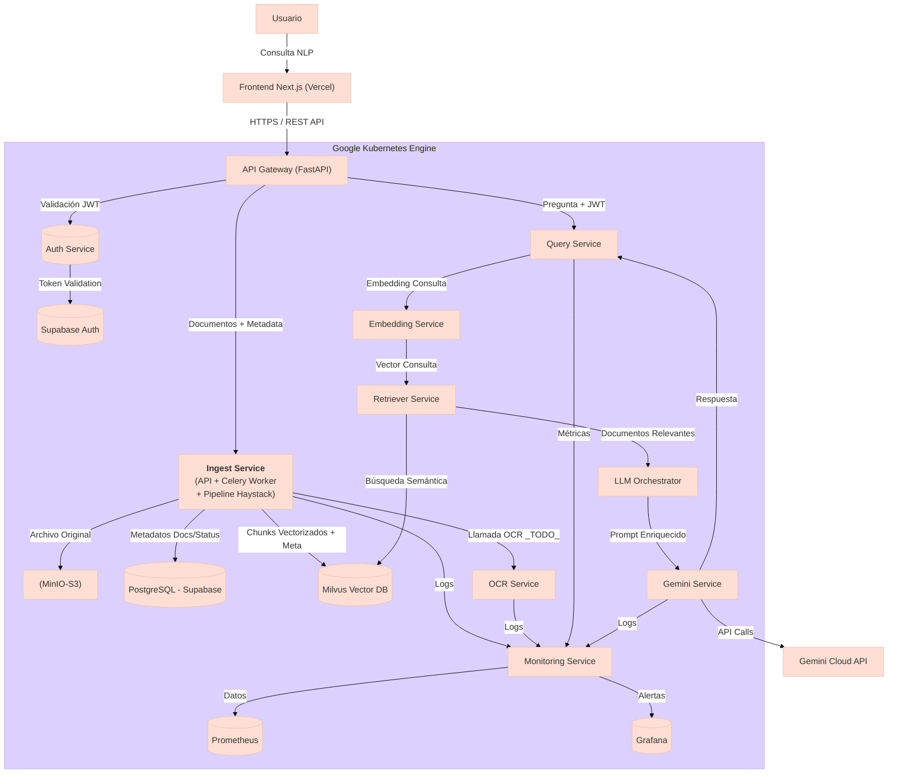

# Ingest Service (Microservicio de Ingesta)

## 1. Visión General

El **Ingest Service** es un microservicio clave dentro de la plataforma SaaS B2B. Su responsabilidad principal es recibir documentos subidos por los usuarios (PDF, DOCX, TXT, etc.), procesarlos de manera asíncrona utilizando un **pipeline integrado de [Haystack](https://haystack.deepset.ai/)**, almacenar los archivos originales y finalmente indexar el contenido procesado en bases de datos para su uso posterior en búsquedas semánticas y generación de respuestas por LLMs.

**Flujo principal:**

1.  **Recepción:** La API recibe el archivo y sus metadatos (`POST /api/v1/ingest`).
2.  **Validación:** Verifica el tipo de archivo y los metadatos.
3.  **Persistencia Inicial:** Guarda el archivo original en **MinIO** (almacenamiento de objetos S3 compatible) y crea un registro inicial del documento en **Supabase (PostgreSQL)** marcándolo como `uploaded`.
4.  **Encolado:** Dispara una tarea asíncrona usando **Celery** (con **Redis** como broker) para el procesamiento pesado.
5.  **Procesamiento Asíncrono (Worker Celery + Haystack):**
    *   La tarea Celery recoge el trabajo.
    *   Descarga el archivo de MinIO.
    *   Actualiza el estado en Supabase a `processing`.
    *   **Ejecuta el Pipeline Haystack:**
        *   **Conversión:** Convierte el formato original (PDF, DOCX, etc.) a texto plano usando componentes como `PyPDFToDocument`, `DOCXToDocument`, etc.
        *   **Chunking:** Divide el texto extraído en fragmentos (chunks) semánticamente coherentes usando `DocumentSplitter`.
        *   **Embedding:** Genera vectores de embedding para cada chunk usando un modelo de lenguaje (ej: `text-embedding-3-small` de **OpenAI**) a través de `OpenAIDocumentEmbedder`.
        *   **Indexación:** Escribe los chunks (contenido textual, vector de embedding y metadatos relevantes) en la base de datos vectorial **Milvus** usando `MilvusDocumentStore` y `DocumentWriter`.
    *   **Actualización Final:** Actualiza el estado del documento en Supabase a `processed` (o `error` si falla) y registra el número de chunks procesados.

Este enfoque asíncrono desacopla la carga y el procesamiento intensivo del flujo principal, mejorando la experiencia del usuario y la escalabilidad del sistema.

## 2. Arquitectura General del Proyecto

El siguiente diagrama ilustra la posición del `Ingest Service` (E1) y su interacción con otros componentes dentro del cluster GKE:



*Nota: El pipeline de Haystack (conversión, chunking, embedding, indexación) se ejecuta **dentro** de los workers del `Ingest Service` (E1) para los tipos de archivo soportados directamente.*

## 3. Características Clave

*   **API RESTful:** Endpoints para ingesta y consulta de estado.
*   **Procesamiento Asíncrono:** Desacoplamiento mediante Celery y Redis.
*   **Almacenamiento de Archivos:** Persistencia de originales en MinIO.
*   **Pipeline Haystack Integrado:** Orquesta la conversión, chunking, embedding (OpenAI) y escritura en Milvus.
*   **Base de Datos Vectorial:** Indexación en **Milvus** para búsqueda semántica eficiente.
*   **Base de Datos Relacional:** Persistencia de metadatos y estado en **Supabase (PostgreSQL)**.
*   **Multi-tenancy:** Aislamiento de datos por empresa (`X-Company-ID`).
*   **Configuración Centralizada:** Uso de ConfigMaps y Secrets en Kubernetes.
*   **Logging Estructurado:** Logs en JSON con `structlog`.

## 4. Pila Tecnológica Principal

*   **Lenguaje:** Python 3.10+
*   **Framework API:** FastAPI
*   **Procesamiento/Orquestación NLP:** Haystack AI 2.x
*   **Procesamiento Asíncrono:** Celery, Redis
*   **Base de Datos Relacional:** Supabase (PostgreSQL)
*   **Base de Datos Vectorial:** Milvus
*   **Almacenamiento de Objetos:** MinIO
*   **Modelo de Embeddings:** OpenAI (`text-embedding-3-small` por defecto)
*   **Despliegue:** Docker, Kubernetes (GKE)

## 5. Estructura de la Codebase

```
app/
├── __init__.py
├── api
│   ├── __init__.py
│   └── v1
│       ├── __init__.py
│       ├── endpoints
│       │   ├── __init__.py
│       │   └── ingest.py # Define los endpoints REST
│       └── schemas.py    # Define los modelos Pydantic para request/response
├── core
│   ├── __init__.py
│   ├── config.py         # Carga y valida la configuración (variables de entorno)
│   └── logging_config.py # Configura el logging estructurado (structlog)
├── db
│   ├── __init__.py
│   ├── base.py           # (Potencialmente para modelos SQLAlchemy, actualmente vacío)
│   └── postgres_client.py # Gestiona la conexión y operaciones con Supabase/PostgreSQL (asyncpg)
├── main.py               # Punto de entrada de la aplicación FastAPI (API)
├── models
│   ├── __init__.py
│   └── domain.py         # Define Enums y modelos de dominio (ej: DocumentStatus)
├── services
│   ├── __init__.py
│   ├── base_client.py    # Cliente HTTP base para comunicarse con otros servicios (si es necesario)
│   └── minio_client.py   # Gestiona la interacción con MinIO (upload/download)
├── tasks
│   ├── __init__.py
│   ├── celery_app.py     # Configura e instancia la aplicación Celery
│   └── process_document.py # Define la tarea Celery principal y el pipeline Haystack
└── utils
    ├── __init__.py
    └── helpers.py        # Funciones de utilidad (actualmente vacío)
```

## 6. Configuración (Kubernetes)

La configuración se gestiona a través del ConfigMap `ingest-service-config` y el Secret `ingest-service-secrets` en el namespace `nyro-develop`.

### ConfigMap (`ingest-service-config`)

Define las conexiones a servicios internos de K8s y parámetros no sensibles.

| Clave                          | Descripción                                                      | Ejemplo (Valor Esperado)                        |
| :----------------------------- | :--------------------------------------------------------------- | :---------------------------------------------- |
| `INGEST_LOG_LEVEL`             | Nivel de logging.                                                | `INFO`                                          |
| `INGEST_CELERY_BROKER_URL`     | URL del servicio Redis master para Celery.                       | `redis://redis-service-master...:6379/0`        |
| `INGEST_CELERY_RESULT_BACKEND` | URL del servicio Redis master para resultados Celery.            | `redis://redis-service-master...:6379/1`        |
| `INGEST_POSTGRES_SERVER`       | Host del **Supabase Session Pooler**.                            | `aws-0-sa-east-1.pooler.supabase.com`           |
| `INGEST_POSTGRES_PORT`         | Puerto del **Supabase Session Pooler**.                          | `5432`                                          |
| `INGEST_POSTGRES_USER`         | Usuario del **Supabase Session Pooler** (`postgres.<project-ref>`). | `postgres.ymsilkrhstwxikjiqqog`                 |
| `INGEST_POSTGRES_DB`           | Base de datos en Supabase.                                       | `postgres`                                      |
| `INGEST_MILVUS_URI`            | URI del servicio Milvus dentro de K8s.                           | `http://milvus-service...:19530`                |
| `INGEST_MILVUS_COLLECTION_NAME`| Nombre de la colección Milvus.                                   | `document_chunks_haystack`                      |
| `INGEST_MINIO_ENDPOINT`        | Endpoint del servicio MinIO dentro de K8s.                       | `minio-service...:9000`                         |
| `INGEST_MINIO_BUCKET_NAME`     | Bucket MinIO para documentos originales.                         | `ingested-documents`                            |
| `INGEST_MINIO_USE_SECURE`      | Usar HTTPS para MinIO.                                           | `false`                                         |
| `INGEST_OPENAI_EMBEDDING_MODEL`| Modelo de embedding OpenAI.                                      | `text-embedding-3-small`                        |
| `INGEST_SPLITTER_CHUNK_SIZE`   | Tamaño de chunk (Haystack).                                      | `500`                                           |
| `INGEST_SPLITTER_CHUNK_OVERLAP`| Superposición de chunks (Haystack).                              | `50`                                            |
| `INGEST_SPLITTER_SPLIT_BY`     | Unidad de división de chunks (Haystack).                         | `word`                                          |
| `INGEST_OCR_SERVICE_URL`       | (Opcional) URL del servicio OCR externo (TODO).                  | `http://ocr-service...`                         |

### Secret (`ingest-service-secrets`)

Contiene las credenciales sensibles.

| Clave del Secreto        | Variable de Entorno Correspondiente | Descripción                |
| :----------------------- | :---------------------------------- | :------------------------- |
| `postgres-password`      | `INGEST_POSTGRES_PASSWORD`          | Contraseña de Supabase.    |
| `minio-access-key`       | `INGEST_MINIO_ACCESS_KEY`           | Access Key de MinIO.       |
| `minio-secret-key`       | `INGEST_MINIO_SECRET_KEY`           | Secret Key de MinIO.       |
| `openai-api-key`         | `INGEST_OPENAI_API_KEY`             | Clave API de OpenAI.       |

## 7. API Endpoints

Prefijo base: `/api/v1` (definido por `settings.API_V1_STR`)

---

### Health Check

*   **Endpoint:** `GET /`
*   **Descripción:** Verifica la disponibilidad del servicio y la conexión a la base de datos. Usado por Kubernetes Probes.
*   **Respuesta Exitosa (`200 OK`):** Indica que el servicio está listo.
    ```json
    {
      "status": "ok",
      "service": "Ingest Service (...)",
      "ready": true
    }
    ```
*   **Respuesta No Listo (`503 Service Unavailable`):** Indica fallo en el arranque o pérdida de conexión a la BD.
    ```json
    { "detail": "Service is not ready..." }
    ```

---

### Ingestar Documento

*   **Endpoint:** `POST /ingest`
*   **Descripción:** Inicia el proceso de ingesta asíncrona de un documento.
*   **Headers Requeridos:**
    *   `X-Company-ID`: (String UUID) Identificador de la empresa.
*   **Request Body:** `multipart/form-data`
    *   `metadata_json`: (String JSON, Opcional) Metadatos adicionales. *Ej: `'{"clave": "valor"}'`*
    *   `file`: (File Binario, **Requerido**) El documento a procesar.
*   **Respuesta (`202 Accepted`):** Confirmación de recepción y encolado.
    ```json
    {
      "document_id": "uuid-del-documento",
      "task_id": "uuid-de-la-tarea-celery",
      "status": "uploaded",
      "message": "Document upload received and queued for processing."
    }
    ```
*   **Tipos de Archivo Soportados:** PDF (con texto), DOCX, TXT, MD, HTML. (Imágenes requieren implementación OCR). Ver `settings.SUPPORTED_CONTENT_TYPES`.

---

### Consultar Estado de Ingesta

*   **Endpoint:** `GET /ingest/status/{document_id}`
*   **Descripción:** Obtiene el estado actual del procesamiento de un documento.
*   **Headers Requeridos:**
    *   `X-Company-ID`: (String UUID) Identificador de la empresa propietaria.
*   **Path Parameters:**
    *   `document_id`: (String UUID) ID del documento a consultar.
*   **Respuesta (`200 OK`):** Detalles del estado del documento.
    ```json
    {
      "document_id": "uuid-del-documento",
      "status": "processed", // "uploaded", "processing", "processed", "error"
      "file_name": "nombre_archivo.pdf",
      "file_type": "application/pdf",
      "chunk_count": 153,    // Si aplica
      "error_message": null, // Si status="error"
      "last_updated": "2025-03-29T21:30:00.123Z", // ISO 8601 UTC
      "message": "Descripción del estado actual."
    }
    ```

---

## 8. Dependencias Externas Clave (Desde la perspectiva del Ingest Service)

*   **Supabase (PostgreSQL):** Almacenamiento de metadatos. Conectado vía **Session Pooler**.
*   **Milvus:** Almacenamiento de vectores. Conectado vía URI del servicio K8s (`http://milvus-service...`).
*   **MinIO:** Almacenamiento de archivos originales. Conectado vía endpoint del servicio K8s (`minio-service...`).
*   **Redis:** Broker de Celery. Conectado vía endpoint del servicio K8s (`redis-service-master...`).
*   **OpenAI API:** Generación de embeddings. Acceso vía Internet (requiere conectividad de salida desde GKE y API Key).
*   **(Futuro) OCR Service:** Extracción de texto de imágenes. Acceso vía endpoint del servicio K8s (si se implementa).

## 9. Pipeline Haystack Interno (Tarea Celery `process_document_haystack`)

El corazón del procesamiento reside en la tarea Celery, que utiliza un pipeline de Haystack compuesto por:

1.  **`Converter`:** (`PyPDFToDocument`, `DOCXToDocument`, etc.) Seleccionado según el `content_type` del archivo. Transforma el archivo binario en un objeto `Document` de Haystack con el texto extraído.
2.  **`DocumentSplitter`:** Divide el objeto `Document` en múltiples `Document` más pequeños (chunks) según la configuración (`split_by`, `split_length`, `split_overlap`).
3.  **`OpenAIDocumentEmbedder`:** Toma la lista de chunks, envía su contenido textual a la API de OpenAI y añade el vector de embedding resultante a cada objeto `Document` del chunk.
4.  **`DocumentWriter` (con `MilvusDocumentStore`):** Recibe los chunks con sus embeddings y metadatos, y los escribe en la colección configurada en la instancia de Milvus.

## 10. TODO / Mejoras Futuras

*   **Implementar OCR:** Integrar con `OCR Service` (E3) o usar un componente Haystack OCR para procesar imágenes (`image/jpeg`, `image/png`).
*   **Seguridad:** Ejecutar contenedores con usuario no-root (`SecurityWarning` actual).
*   **Validación:** Mejorar validación de `metadata_json` y añadir límites de tamaño de archivo en el endpoint `/ingest`.
*   **Tests:** Añadir tests unitarios y de integración (API, Tareas Celery, Pipeline Haystack).
*   **Manejo de Errores:** Refinar gestión de errores específicos del pipeline Haystack y llamadas externas (Milvus, OpenAI).
*   **Optimización:** Ajustar parámetros de Haystack (chunking, embedding) y Milvus (indexación, búsqueda) para rendimiento y precisión.
*   **Observabilidad:** Integrar tracing distribuido (OpenTelemetry).
*   **Escalabilidad:** Configurar Horizontal Pod Autoscaler (HPA) para API y workers Celery.

## 11. Licencia

(Especificar Licencia aquí)
```