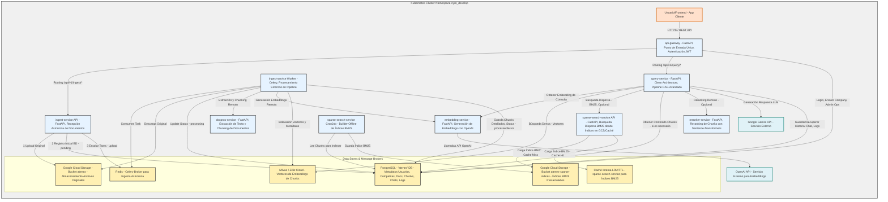

```mermaid
graph TD
    %% External User / Frontend
    User_Frontend["Usuario/Frontend - App Cliente"]

    subgraph Kubernetes_Cluster_nyro_develop [Kubernetes Cluster Namespace nyro_develop]
        direction TB

        %% API Gateway - Punto de Entrada
        API_Gateway["api-gateway - FastAPI, Punto de Entrada Único, Autenticación JWT"]

        %% Core Services
        Ingest_Service_API["ingest-service API - FastAPI, Recepción Asíncrona de Documentos"]
        Ingest_Service_Worker["ingest-service Worker - Celery, Procesamiento Síncrono en Pipeline"]

        DocProc_Service["docproc-service - FastAPI, Extracción de Texto y Chunking de Documentos"]
        Embedding_Service["embedding-service - FastAPI, Generación de Embeddings con OpenAI"]

        Query_Service["query-service - FastAPI, Clean Architecture, Pipeline RAG Avanzado"]

        Reranker_Service["reranker-service - FastAPI, Reranking de Chunks con Sentence-Transformers"]
        Sparse_Search_Service_API["sparse-search-service API - FastAPI, Búsqueda Dispersa BM25 desde Índices en GCS/Caché"]
        Sparse_Search_CronJob["sparse-search-service CronJob - Builder Offline de Índices BM25"]

        %% Data Stores & Brokers
        subgraph Data_Stores_Brokers ["Data Stores & Message Brokers"]
            direction LR
            PostgreSQL["PostgreSQL - 'atenex' DB - Metadatos Usuarios, Compañías, Docs, Chunks, Chats, Logs"]
            Milvus_Zilliz["Milvus / Zilliz Cloud - Vectores de Embeddings de Chunks"]
            Redis_Celery["Redis - Celery Broker para Ingesta Asíncrona"]
            GCS_Atenex_Bucket["Google Cloud Storage - Bucket atenex - Almacenamiento Archivos Originales"]
            GCS_Sparse_Indexes_Bucket["Google Cloud Storage - Bucket atenex-sparse-indices - Índices BM25 Precalculados"]
            Internal_Cache_SSS["Caché Interna LRU/TTL - sparse-search-service para Índices BM25"]
        end

        %% --- Flujos Principales ---

        %% User Authentication and Gateway Requests
        User_Frontend -->|HTTPS / REST API| API_Gateway

        API_Gateway -->|Routing /api/v1/ingest/*| Ingest_Service_API
        API_Gateway -->|Routing /api/v1/query/*| Query_Service
        API_Gateway -->|Login, Ensure Company, Admin Ops| PostgreSQL

        %% Ingestion Flow
        Ingest_Service_API -->|1 Upload Original| GCS_Atenex_Bucket
        Ingest_Service_API -->|2 Registro Inicial BD - pending| PostgreSQL
        Ingest_Service_API -->|3 Encolar Tarea - upload| Redis_Celery

        Ingest_Service_Worker -- Consumes Task --> Redis_Celery
        Ingest_Service_Worker -->|Descarga Original| GCS_Atenex_Bucket
        Ingest_Service_Worker -->|Update Status - processing| PostgreSQL
        Ingest_Service_Worker -->|Extracción y Chunking Remoto| DocProc_Service
        Ingest_Service_Worker -->|Generación Embeddings Remota| Embedding_Service
        Ingest_Service_Worker -->|Indexación Vectores y Metadatos| Milvus_Zilliz
        Ingest_Service_Worker -->|Guarda Chunks Detallados, Status - processed/error| PostgreSQL

        %% Query Flow (RAG Pipeline)
        Query_Service -->|Obtener Embedding de Consulta| Embedding_Service
        Query_Service -->|Búsqueda Densa - Vectores| Milvus_Zilliz
        Query_Service -->|Búsqueda Dispersa - BM25, Opcional| Sparse_Search_Service_API
        Query_Service -->|Obtener Contenido Chunks - si es necesario| PostgreSQL
        Query_Service -->|Reranking Remoto - Opcional| Reranker_Service
        Query_Service -->|Generación Respuesta LLM| Gemini_API["Google Gemini API - Servicio Externo"]
        Query_Service -->|Guardar/Recuperar Historial Chat, Logs| PostgreSQL


        %% Dependencies of Supporting Services
        Embedding_Service -->|Llamadas API OpenAI| OpenAI_API["OpenAI API - Servicio Externo para Embeddings"]
        
        Sparse_Search_Service_API -->|Carga Índice BM25 - Cache Miss| GCS_Sparse_Indexes_Bucket
        Sparse_Search_Service_API -->|Carga Índice BM25 - Cache Hit| Internal_Cache_SSS

        Sparse_Search_CronJob -->|Lee Chunks para Indexar| PostgreSQL
        Sparse_Search_CronJob -->|Guarda Índice BM25| GCS_Sparse_Indexes_Bucket
    end

    %% Styling
    classDef service fill:#e6f3ff,stroke:#333,stroke-width:2px,color:#333
    classDef datastore fill:#fff0b3,stroke:#333,stroke-width:2px,color:#333
    classDef external fill:#e0f2f7,stroke:#00796b,stroke-width:2px,color:#333
    classDef user fill:#ffe0cc,stroke:#d95f00,stroke-width:2px,color:#333
    classDef k8scluster fill:#f0f0f0,stroke:#555,stroke-width:2px,color:#333

    class User_Frontend user;
    class API_Gateway,Ingest_Service_API,Ingest_Service_Worker,DocProc_Service,Embedding_Service,Query_Service,Reranker_Service,Sparse_Search_Service_API,Sparse_Search_CronJob service;
    class PostgreSQL,Milvus_Zilliz,Redis_Celery,GCS_Atenex_Bucket,GCS_Sparse_Indexes_Bucket,Internal_Cache_SSS datastore;
    class OpenAI_API,Gemini_API external;
    class Kubernetes_Cluster_nyro_develop k8scluster;
```