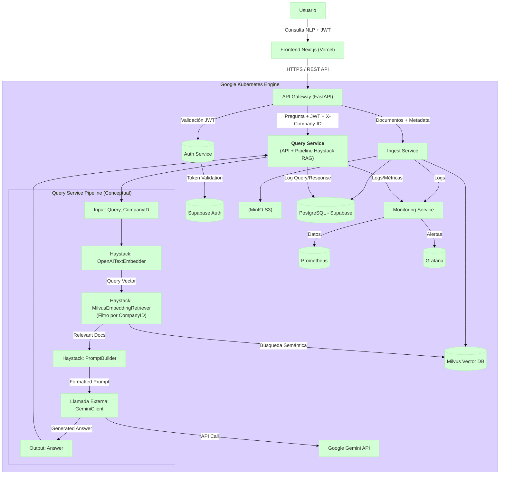

# Query Service (Microservicio de Consulta)

## 1. Visión General

El **Query Service** es el microservicio responsable de manejar las consultas en lenguaje natural de los usuarios dentro de la plataforma SaaS B2B. Su función principal es recibir una pregunta del usuario (`query`), utilizar un **pipeline de Retrieval-Augmented Generation (RAG) construido con [Haystack](https://haystack.deepset.ai/)** para encontrar información relevante en los documentos previamente ingeridos por el `ingest-service` (indexados en Milvus), generar una respuesta coherente utilizando un Large Language Model (LLM) externo (configurado para usar Google Gemini), y registrar la interacción para auditoría y análisis futuros.

**Flujo principal:**

1.  **Recepción:** La API (`POST /api/v1/query`) recibe la consulta del usuario (`query`) y el identificador de la empresa (`X-Company-ID` en headers). Se asume que la autenticación (JWT) es manejada por un API Gateway o servicio previo.
2.  **Validación:** Verifica la presencia y formato de `query` y `X-Company-ID`.
3.  **Ejecución del Pipeline RAG (Orquestado en `app.pipelines.rag_pipeline.py`):**
    *   **Embedding de Consulta:** Convierte la `query` en un vector usando `OpenAITextEmbedder` (modelo definido en config, ej: `text-embedding-3-small`).
    *   **Recuperación (Retrieval):** `MilvusEmbeddingRetriever` busca en la colección Milvus (definida en config) los chunks de documentos más relevantes para el vector de la consulta. **Crucialmente, aplica un filtro estricto para devolver solo documentos pertenecientes al `company_id` proporcionado.** El número de documentos (`top_k`) es configurable.
    *   **Construcción del Prompt:** `PromptBuilder` toma la `query` original y el contenido de los `documents` recuperados, y los inserta en una plantilla predefinida (configurable) diseñada para instruir al LLM.
    *   **Generación de Respuesta (Llamada Externa):** Se utiliza el cliente `app.services.gemini_client.py` para enviar el prompt generado a la API de Google Gemini (modelo definido en config, ej: `gemini-1.5-flash-latest`).
4.  **Persistencia del Log:** La función `app.db.postgres_client.log_query_interaction` registra la consulta, la respuesta generada, los IDs y scores de los documentos recuperados, y metadatos relevantes (como modelos usados) en la tabla `query_logs` de Supabase (PostgreSQL).
5.  **Respuesta:** Devuelve la respuesta generada por Gemini y la información sobre los documentos recuperados al cliente (`QueryResponse`).

Este servicio se centra en la recuperación eficiente y filtrada por tenant, y en la generación de respuestas contextualizadas, manteniendo la coherencia con la arquitectura y tecnologías del `ingest-service`.

## 2. Arquitectura General del Proyecto (Posición del Query Service)

El `Query Service` (G1) se sitúa detrás del API Gateway y es invocado por este tras validar el JWT. Interactúa con Supabase (para logging), Milvus (para retrieval), OpenAI (para embedding de consulta) y Google Gemini (para generación de respuesta).


*Nota: El pipeline de Haystack maneja el embedding y retrieval. La generación se realiza mediante una llamada directa a la API de Gemini desde el servicio.*

## 3. Características Clave

*   **API RESTful:** Endpoint `POST /api/v1/query` para consultas.
*   **Pipeline RAG con Haystack:** Orquesta embedding (OpenAI), retrieval filtrado (Milvus) y construcción de prompt.
*   **Integración con Google Gemini:** Utiliza la API de Gemini para la generación final de respuestas.
*   **Multi-tenancy Estricto:** Filtra documentos por `company_id` en Milvus durante el retrieval.
*   **Logging de Consultas:** Persistencia detallada en Supabase (`query_logs`).
*   **Configuración Centralizada:** Uso de ConfigMaps (`query-service-config`) y Secrets (`query-service-secrets`) en Kubernetes.
*   **Logging Estructurado:** Logs en JSON con `structlog`.
*   **Health Check Robusto:** Endpoint `/` optimizado para Kubernetes probes.
*   **Manejo de Errores:** Captura y loguea errores de dependencias y del pipeline.

## 4. Pila Tecnológica Principal

*   **Lenguaje:** Python 3.10+
*   **Framework API:** FastAPI
*   **Orquestación RAG:** Haystack AI 2.x (`haystack-ai`)
*   **Base de Datos Relacional (Logging):** Supabase (PostgreSQL) vía `asyncpg`.
*   **Base de Datos Vectorial (Retrieval):** Milvus vía `milvus-haystack`.
*   **Modelo de Embeddings (Query):** OpenAI (`text-embedding-3-small` por defecto) vía `openai`.
*   **Modelo de Lenguaje Grande (Generación):** Google Gemini vía `google-generativeai`.
*   **Despliegue:** Docker, Kubernetes (GKE / local en K8s de Docker Desktop).
*   **Servidor ASGI:** Gunicorn + Uvicorn workers.

## 5. Estructura de la Codebase

```
query-service/
├── app/
│   ├── __init__.py
│   ├── api/
│   │   ├── __init__.py
│   │   └── v1/
│   │       ├── __init__.py
│   │       ├── endpoints/
│   │       │   ├── __init__.py
│   │       │   └── query.py      # Define POST /query
│   │       └── schemas.py        # Define Pydantic models (Request/Response)
│   ├── core/
│   │   ├── __init__.py
│   │   ├── config.py         # Carga configuración (Pydantic BaseSettings)
│   │   └── logging_config.py # Configura structlog
│   ├── db/
│   │   ├── __init__.py
│   │   └── postgres_client.py # Cliente asyncpg para Supabase (logging)
│   ├── main.py               # Entrypoint FastAPI, startup/shutdown, health check
│   ├── models/               # Vacío por ahora
│   │   └── __init__.py
│   ├── pipelines/            # Lógica del pipeline Haystack
│   │   ├── __init__.py
│   │   └── rag_pipeline.py   # Construye y ejecuta el pipeline RAG
│   ├── services/             # Clientes para APIs externas
│   │   ├── __init__.py
│   │   ├── base_client.py    # Cliente HTTP base (reutilizable)
│   │   └── gemini_client.py  # Cliente específico para Google Gemini API
│   └── utils/
│       ├── __init__.py
│       └── helpers.py        # Funciones de utilidad
├── Dockerfile                # Define cómo construir la imagen Docker
├── pyproject.toml            # Define dependencias (Poetry)
├── README.md                 # Este archivo
└── .env.example              # Ejemplo de variables de entorno locales
```

## 6. Configuración (Kubernetes)

Gestionada mediante ConfigMap `query-service-config` y Secret `query-service-secrets` en el namespace `nyro-develop`.

### ConfigMap (`query-service-config`)

| Clave                           | Descripción                                                          | Ejemplo (Valor Esperado)                               | Notas                                                       |
| :------------------------------ | :------------------------------------------------------------------- | :----------------------------------------------------- | :---------------------------------------------------------- |
| `QUERY_LOG_LEVEL`               | Nivel de logging (DEBUG, INFO, WARNING, ERROR).                      | `INFO`                                                 |                                                             |
| `QUERY_POSTGRES_SERVER`         | Host del Supabase Session Pooler.                                    | `aws-0-sa-east-1.pooler.supabase.com`                  |                                                             |
| `QUERY_POSTGRES_PORT`           | Puerto del Supabase Session Pooler.                                  | `5432` (*Corregido*)                                   | Puerto estándar de PG, Pooler usa este por defecto ahora. |
| `SUPABASE_PROJECT_REF`          | Referencia del proyecto Supabase (usada para construir user).         | `ymsilkrhstwxikjiqqog`                                 | **¡Ajustar a tu proyecto!**                               |
| `QUERY_POSTGRES_USER`           | Usuario del Supabase Session Pooler (`postgres.<project-ref>`).      | `postgres.ymsilkrhstwxikjiqqog`                        | Construido a partir de `SUPABASE_PROJECT_REF` en `config.py` |
| `QUERY_POSTGRES_DB`             | Base de datos en Supabase.                                           | `postgres`                                             |                                                             |
| `QUERY_MILVUS_URI`              | URI del servicio Milvus (DNS interno de K8s).                        | `http://milvus-milvus.default.svc.cluster.local:19530` | **Corregido: apunta a `default` ns**                      |
| `QUERY_MILVUS_COLLECTION_NAME`  | Nombre de la colección Milvus.                                       | `document_chunks_haystack`                             | Debe coincidir con `ingest-service`                         |
| `QUERY_MILVUS_EMBEDDING_FIELD`  | Nombre del campo vectorial en Milvus.                                | `embedding`                                            | Usado por el Retriever. Default `milvus-haystack`.        |
| `QUERY_MILVUS_CONTENT_FIELD`    | Nombre del campo de contenido textual en Milvus.                     | `content`                                              | Usado por el Retriever. Default `milvus-haystack`.        |
| `QUERY_MILVUS_COMPANY_ID_FIELD` | Nombre del campo de metadatos para filtrar por empresa.               | `company_id`                                           | **CRUCIAL** para multi-tenancy                            |
| `QUERY_OPENAI_EMBEDDING_MODEL`  | Modelo de embedding OpenAI para la consulta.                         | `text-embedding-3-small`                               | **Debe coincidir** con `ingest-service`                   |
| `QUERY_EMBEDDING_DIMENSION`     | Dimensión del vector de embedding (auto-ajustado en config).         | `1536`                                                 |                                                             |
| `QUERY_RETRIEVER_TOP_K`         | Número de documentos a recuperar de Milvus por defecto.              | `5`                                                    | Puede sobreescribirse por request.                        |
| `QUERY_GEMINI_MODEL_NAME`       | Nombre del modelo Gemini a usar para generación.                     | `gemini-1.5-flash-latest`                              |                                                             |
| `QUERY_RAG_PROMPT_TEMPLATE`     | (Opcional) Plantilla Jinja2 para el prompt RAG.                      | *(Ver default en `config.py`)*                         | Se usa el default si no se especifica aquí.               |
| `QUERY_MAX_PROMPT_TOKENS`       | (Opcional) Límite *aproximado* de tokens para el prompt a Gemini.    | `7000`                                                 | No implementado activamente (truncamiento/etc.).          |
| `QUERY_HTTP_CLIENT_TIMEOUT`     | Timeout para clientes HTTP (ej: Gemini).                             | `60`                                                   | En segundos.                                                |
| `QUERY_HTTP_CLIENT_MAX_RETRIES` | Máximo de reintentos para clientes HTTP.                             | `2`                                                    |                                                             |
| `QUERY_HTTP_CLIENT_BACKOFF_FACTOR`| Factor de backoff exponencial para reintentos.                     | `1.0`                                                  |                                                             |

### Secret (`query-service-secrets`)

| Clave del Secreto     | Variable de Entorno Correspondiente | Descripción                                   |
| :-------------------- | :---------------------------------- | :-------------------------------------------- |
| `postgres-password`   | `QUERY_POSTGRES_PASSWORD`           | Contraseña de Supabase (Pooler).              |
| `openai-api-key`      | `QUERY_OPENAI_API_KEY`              | Clave API de OpenAI (para embedding consulta). |
| `gemini-api-key`      | `QUERY_GEMINI_API_KEY`              | Clave API para Google Gemini.                 |

## 7. API Endpoints

Prefijo base: `/api/v1`

---

### Health Check

*   **Endpoint:** `GET /`
*   **Descripción:** Chequeo básico de Liveness/Readiness para Kubernetes. Verifica si el servicio se inició correctamente (variable interna `SERVICE_READY`). **No realiza chequeos activos de dependencias externas** para mayor estabilidad de los probes.
*   **Respuesta Exitosa (`200 OK`):** Indica que el servicio arrancó y está aceptando conexiones.
    ```plain
    OK
    ```
*   **Respuesta No Listo (`503 Service Unavailable`):** Indica que el flag `SERVICE_READY` es `False` (fallo crítico durante el startup).
    ```json
    { "detail": "Service is not ready or failed during startup." }
    ```

---

### Realizar Consulta (RAG)

*   **Endpoint:** `POST /query`
*   **Descripción:** Recibe una consulta, ejecuta el pipeline RAG (embedding, retrieval filtrado, prompt, generación con Gemini), loguea la interacción y devuelve la respuesta.
*   **Headers Requeridos:**
    *   `X-Company-ID`: (String UUID) Identificador de la empresa para filtrar documentos.
    *   `Authorization`: (String) `Bearer <JWT_TOKEN>` (Se asume validado previamente).
*   **Request Body:** (`application/json`)
    ```json
    {
      "query": "string",
      "retriever_top_k": int | null // Opcional
    }
    ```
    *   **Schema Pydantic:** `schemas.QueryRequest`
*   **Respuesta Exitosa (`200 OK`):**
    ```json
    {
      "answer": "string",
      "retrieved_documents": [
        {
          "id": "string",
          "score": float | null,
          "content_preview": "string" | null,
          "metadata": { ... } | null,
          "document_id": "string" | null,
          "file_name": "string" | null
        }
      ],
      "query_log_id": "uuid" | null
    }
    ```
    *   **Schema Pydantic:** `schemas.QueryResponse`
*   **Respuestas de Error Comunes:**
    *   `400 Bad Request`: `query` vacío o formato inválido.
    *   `401 Unauthorized`: Falta `X-Company-ID`.
    *   `500 Internal Server Error`: Error inesperado durante la ejecución del pipeline o llamada a Gemini.
    *   `503 Service Unavailable`: Fallo al conectar con dependencias críticas (Milvus, Gemini API) durante el procesamiento de la query, o si el pipeline no pudo construirse en startup.

## 8. Dependencias Externas Clave

*   **Supabase (PostgreSQL):** Almacenamiento de `query_logs`. Conectado vía Session Pooler.
*   **Milvus:** Base de datos vectorial para retrieval. Conectado vía DNS interno de Kubernetes.
*   **OpenAI API:** Para generar embeddings de consulta. Acceso vía Internet.
*   **Google Gemini API:** Para generar respuestas. Acceso vía Internet.
*   **API Gateway:** Punto de entrada para las peticiones.
*   **Auth Service:** (Implícito) Valida JWT.

## 9. Pipeline Haystack (`app/pipelines/rag_pipeline.py`)

1.  **`OpenAITextEmbedder`:** Genera el embedding para la `query`.
2.  **`MilvusEmbeddingRetriever`:** Busca en Milvus usando el embedding y el filtro `{ "company_id": <ID> }`.
3.  **`PromptBuilder`:** Construye el prompt final usando la plantilla y los documentos recuperados.
4.  **(Fuera del pipeline Haystack)** `GeminiClient`: Llama a la API de Google Gemini con el prompt generado.

## 10. Consideraciones Adicionales

*   **Placeholder User ID:** La función `get_current_user_id` necesita ser implementada con la lógica real de extracción del ID de usuario desde el JWT.
*   **Gestión de Contexto Largo:** No implementado activamente. Si el contexto recuperado es muy largo, la llamada a Gemini podría fallar o truncarse. Se requeriría lógica adicional (chunking, summarization, etc.) si esto es un problema.
*   **Prompt Engineering:** La plantilla por defecto es básica. Podría necesitar ajustes finos para mejorar la calidad y el seguimiento de instrucciones por parte de Gemini.
*   **Errores de API Externas:** El manejo de errores para OpenAI y Gemini se basa en reintentos (`tenacity`) y la captura de excepciones genéricas. Podría refinarse para manejar códigos de error específicos (rate limits, errores de autenticación, etc.).

## 11. TODO / Mejoras Futuras

*   **Implementar Extracción User ID:** Reemplazar el placeholder `get_current_user_id`.
*   **Tests:** Añadir tests unitarios y de integración.
*   **Observabilidad:** Integrar tracing distribuido (OpenTelemetry).
*   **Manejo de Chat History:** Implementar la lógica para usar `chat_history` en el `PromptBuilder`.
*   **Gestión de Contexto Largo:** Añadir estrategia si es necesario.
*   **Evaluación RAG / Feedback:** Implementar mecanismos de evaluación y feedback.
*   **Soporte Híbrido/Sparse:** Alinear con `ingest-service` si implementa otros tipos de retrieval.
