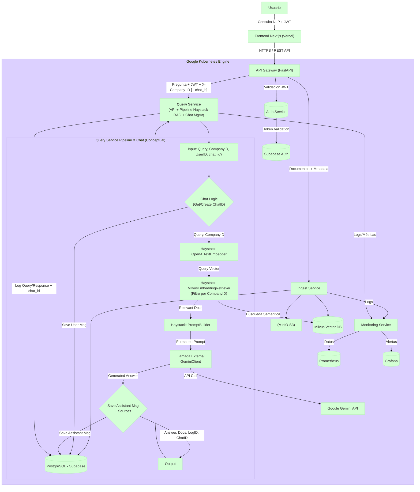

# Query Service (Microservicio de Consulta)

## 1. Visión General

El **Query Service** es el microservicio responsable de manejar las consultas en lenguaje natural de los usuarios dentro de la plataforma SaaS B2B. Su función principal es recibir una pregunta del usuario (`query`), utilizar un **pipeline de Retrieval-Augmented Generation (RAG) construido con [Haystack](https://haystack.deepset.ai/)** para encontrar información relevante en los documentos previamente ingeridos por el `ingest-service` (indexados en Milvus), generar una respuesta coherente utilizando un Large Language Model (LLM) externo (configurado para usar Google Gemini), y registrar la interacción para auditoría y análisis futuros.

**Además de procesar consultas individuales, el servicio ahora gestiona el historial de conversaciones persistente.** Permite a los usuarios continuar conversaciones existentes o iniciar nuevas, almacenando los mensajes de usuario y asistente en la base de datos relacional (Supabase).

**Flujo principal (con Chat):**

1.  **Recepción:** La API (`POST /api/v1/query`) recibe la consulta del usuario (`query`), el identificador de la empresa (`X-Company-ID` en headers) y opcionalmente un `chat_id`. Se asume que la autenticación (JWT) es manejada por un API Gateway o servicio previo, **y es necesaria para usar la funcionalidad de chat.**
2.  **Validación:** Verifica la presencia y formato de `query`, `X-Company-ID` y la validez/propiedad del `chat_id` si se proporciona.
3.  **Gestión del Chat:**
    *   Si se proporciona un `chat_id` válido y perteneciente al usuario, se continúa la conversación existente.
    *   Si no se proporciona `chat_id` o es inválido (y el usuario está autenticado), se crea un nuevo chat en la base de datos.
    *   Se guarda el mensaje del usuario (`role: 'user'`) en la tabla `messages`.
4.  **Ejecución del Pipeline RAG (Orquestado en `app.pipelines.rag_pipeline.py`):**
    *   **Embedding de Consulta:** Convierte la `query` en un vector usando `OpenAITextEmbedder`.
    *   **Recuperación (Retrieval):** `MilvusEmbeddingRetriever` busca en Milvus los chunks relevantes, **filtrando por `company_id`**.
    *   **Construcción del Prompt:** `PromptBuilder` combina la `query` y los `documents` recuperados en una plantilla.
    *   **Generación de Respuesta (Llamada Externa):** `app.services.gemini_client.py` envía el prompt a la API de Google Gemini.
5.  **Persistencia del Mensaje del Asistente:** Se guarda el mensaje generado por el LLM (`role: 'assistant'`) en la tabla `messages`, incluyendo las fuentes (`retrieved_documents`) si las hubiera. Se actualiza el timestamp `updated_at` del chat.
6.  **Persistencia del Log:** La función `app.db.postgres_client.log_query_interaction` registra la consulta, la respuesta, los documentos recuperados, metadatos y el `chat_id` asociado en la tabla `query_logs`.
7.  **Respuesta:** Devuelve la respuesta generada, los documentos recuperados, el `query_log_id` y el `chat_id` (existente o nuevo) al cliente (`QueryResponse`).

Este servicio se centra en la recuperación eficiente y filtrada por tenant, la generación de respuestas contextualizadas y ahora también en la **gestión persistente del historial de chat**, manteniendo la coherencia con la arquitectura y tecnologías del `ingest-service`.

## 2. Arquitectura General del Proyecto (Posición del Query Service)

El `Query Service` (G1) se sitúa detrás del API Gateway y es invocado por este tras validar el JWT. Interactúa con Supabase (para logging **y almacenamiento de chats/mensajes**), Milvus (para retrieval), OpenAI (para embedding de consulta) y Google Gemini (para generación de respuesta).


*Nota: El pipeline de Haystack maneja embedding y retrieval. La generación usa Gemini. La gestión de chat (creación de ID, guardado de mensajes) se integra en el flujo del endpoint `/query` y usa Supabase.*

## 3. Características Clave

*   **API RESTful:**
    *   Endpoint `POST /api/v1/query` para consultas RAG **y gestión de conversaciones**.
    *   **Nuevos Endpoints para Gestión de Chat:** `GET /api/v1/chats`, `GET /api/v1/chats/{chat_id}/messages`, `DELETE /api/v1/chats/{chat_id}`.
*   **Pipeline RAG con Haystack:** Orquesta embedding (OpenAI), retrieval filtrado (Milvus) y construcción de prompt.
*   **Integración con Google Gemini:** Utiliza la API de Gemini para la generación final de respuestas.
*   **Gestión de Historial de Chat Persistente:** Almacena conversaciones (chats y mensajes) en Supabase (PostgreSQL), asociadas a usuarios y empresas.
*   **Multi-tenancy Estricto:** Filtra documentos por `company_id` en Milvus durante el retrieval y asegura que los usuarios solo accedan a sus propios chats.
*   **Logging de Consultas:** Persistencia detallada en Supabase (`query_logs`), **ahora incluyendo `chat_id`**.
*   **Configuración Centralizada:** Uso de ConfigMaps (`query-service-config`) y Secrets (`query-service-secrets`) en Kubernetes.
*   **Logging Estructurado:** Logs en JSON con `structlog`.
*   **Health Check Robusto:** Endpoint `/` optimizado para Kubernetes probes.
*   **Manejo de Errores:** Captura y loguea errores de dependencias, pipeline y validación.

## 4. Pila Tecnológica Principal

*   **Lenguaje:** Python 3.10+
*   **Framework API:** FastAPI
*   **Orquestación RAG:** Haystack AI 2.x (`haystack-ai`)
*   **Base de Datos Relacional (Logging & Chat):** Supabase (PostgreSQL) vía `asyncpg`.
*   **Base de Datos Vectorial (Retrieval):** Milvus vía `milvus-haystack`.
*   **Modelo de Embeddings (Query):** OpenAI (`text-embedding-3-small` por defecto) vía `openai`.
*   **Modelo de Lenguaje Grande (Generación):** Google Gemini vía `google-generativeai`.
*   **Despliegue:** Docker, Kubernetes (GKE / local en K8s de Docker Desktop).
*   **Servidor ASGI:** Gunicorn + Uvicorn workers.

## 5. Estructura de la Codebase

```
query-service/
├── app/
│   ├── __init__.py
│   ├── api/
│   │   ├── __init__.py
│   │   └── v1/
│   │       ├── __init__.py
│   │       ├── endpoints/
│   │       │   ├── __init__.py
│   │       │   ├── chat.py       # Define GET /chats, GET /chats/{id}/messages, DELETE /chats/{id}
│   │       │   └── query.py      # Define POST /query (con lógica de chat integrada)
│   │       └── schemas.py        # Define modelos Pydantic (Request/Response/Chat/Message)
│   ├── core/
│   │   ├── __init__.py
│   │   ├── config.py         # Carga configuración (Pydantic BaseSettings)
│   │   └── logging_config.py # Configura structlog
│   ├── db/
│   │   ├── __init__.py
│   │   └── postgres_client.py # Cliente asyncpg para Supabase (logging, chats, messages)
│   ├── main.py               # Entrypoint FastAPI, startup/shutdown, health check, routers
│   ├── models/               # Vacío por ahora
│   │   └── __init__.py
│   ├── pipelines/            # Lógica del pipeline Haystack
│   │   ├── __init__.py
│   │   └── rag_pipeline.py   # Construye y ejecuta el pipeline RAG
│   ├── services/             # Clientes para APIs externas
│   │   ├── __init__.py
│   │   ├── base_client.py    # Cliente HTTP base (reutilizable)
│   │   └── gemini_client.py  # Cliente específico para Google Gemini API
│   └── utils/
│       ├── __init__.py
│       └── helpers.py        # Funciones de utilidad
├── Dockerfile                # Define cómo construir la imagen Docker
├── pyproject.toml            # Define dependencias (Poetry)
├── README.md                 # Este archivo
└── .env.example              # Ejemplo de variables de entorno locales
```

## 6. Configuración (Kubernetes)

Gestionada mediante ConfigMap `query-service-config` y Secret `query-service-secrets` en el namespace `nyro-develop`.

*(La tabla de ConfigMap y Secret permanece sin cambios ya que no se añadieron nuevas variables de entorno específicas para la funcionalidad de chat en esta implementación)*

### ConfigMap (`query-service-config`)

| Clave                           | Descripción                                                          | Ejemplo (Valor Esperado)                               | Notas                                                       |
| :------------------------------ | :------------------------------------------------------------------- | :----------------------------------------------------- | :---------------------------------------------------------- |
| `QUERY_LOG_LEVEL`               | Nivel de logging (DEBUG, INFO, WARNING, ERROR).                      | `INFO`                                                 |                                                             |
| `QUERY_POSTGRES_SERVER`         | Host del Supabase Session Pooler.                                    | `aws-0-sa-east-1.pooler.supabase.com`                  |                                                             |
| `QUERY_POSTGRES_PORT`           | Puerto del Supabase Session Pooler.                                  | `5432`                                                 | Puerto estándar de PG.                                      |
| `SUPABASE_PROJECT_REF`          | Referencia del proyecto Supabase (usada para construir user).         | `ymsilkrhstwxikjiqqog`                                 | **¡Ajustar a tu proyecto!**                               |
| `QUERY_POSTGRES_USER`           | Usuario del Supabase Session Pooler (`postgres.<project-ref>`).      | `postgres.ymsilkrhstwxikjiqqog`                        | Construido a partir de `SUPABASE_PROJECT_REF` en `config.py` |
| `QUERY_POSTGRES_DB`             | Base de datos en Supabase.                                           | `postgres`                                             |                                                             |
| `QUERY_MILVUS_URI`              | URI del servicio Milvus (DNS interno de K8s).                        | `http://milvus-milvus.default.svc.cluster.local:19530` | Apunta a `default` ns.                                      |
| `QUERY_MILVUS_COLLECTION_NAME`  | Nombre de la colección Milvus.                                       | `document_chunks_haystack`                             | Debe coincidir con `ingest-service`                         |
| `QUERY_MILVUS_EMBEDDING_FIELD`  | Nombre del campo vectorial en Milvus.                                | `embedding`                                            | Usado por el Retriever.                                     |
| `QUERY_MILVUS_CONTENT_FIELD`    | Nombre del campo de contenido textual en Milvus.                     | `content`                                              | Usado por el Retriever.                                     |
| `QUERY_MILVUS_COMPANY_ID_FIELD` | Nombre del campo de metadatos para filtrar por empresa.               | `company_id`                                           | **CRUCIAL** para multi-tenancy                            |
| `QUERY_OPENAI_EMBEDDING_MODEL`  | Modelo de embedding OpenAI para la consulta.                         | `text-embedding-3-small`                               | **Debe coincidir** con `ingest-service`                   |
| `QUERY_EMBEDDING_DIMENSION`     | Dimensión del vector de embedding (auto-ajustado en config).         | `1536`                                                 |                                                             |
| `QUERY_RETRIEVER_TOP_K`         | Número de documentos a recuperar de Milvus por defecto.              | `5`                                                    | Puede sobreescribirse por request.                        |
| `QUERY_GEMINI_MODEL_NAME`       | Nombre del modelo Gemini a usar para generación.                     | `gemini-1.5-flash-latest`                              |                                                             |
| `QUERY_RAG_PROMPT_TEMPLATE`     | (Opcional) Plantilla Jinja2 para el prompt RAG.                      | *(Ver default en `config.py`)*                         | Se usa el default si no se especifica aquí.               |
| `QUERY_MAX_PROMPT_TOKENS`       | (Opcional) Límite *aproximado* de tokens para el prompt a Gemini.    | `7000`                                                 | No implementado activamente (truncamiento/etc.).          |
| `QUERY_HTTP_CLIENT_TIMEOUT`     | Timeout para clientes HTTP (ej: Gemini).                             | `60`                                                   | En segundos.                                                |
| `QUERY_HTTP_CLIENT_MAX_RETRIES` | Máximo de reintentos para clientes HTTP.                             | `2`                                                    |                                                             |
| `QUERY_HTTP_CLIENT_BACKOFF_FACTOR`| Factor de backoff exponencial para reintentos.                     | `1.0`                                                  |                                                             |

### Secret (`query-service-secrets`)

| Clave del Secreto     | Variable de Entorno Correspondiente | Descripción                                   |
| :-------------------- | :---------------------------------- | :-------------------------------------------- |
| `postgres-password`   | `QUERY_POSTGRES_PASSWORD`           | Contraseña de Supabase (Pooler).              |
| `openai-api-key`      | `QUERY_OPENAI_API_KEY`              | Clave API de OpenAI (para embedding consulta). |
| `gemini-api-key`      | `QUERY_GEMINI_API_KEY`              | Clave API para Google Gemini.                 |

## 7. API Endpoints

Prefijo base: `/api/v1`

---

### Health Check

*   **Endpoint:** `GET /`
*   **Descripción:** Chequeo básico de Liveness/Readiness para Kubernetes. Verifica si el servicio se inició correctamente (variable interna `SERVICE_READY`).
*   **Respuesta Exitosa (`200 OK`):**
    ```plain
    OK
    ```
*   **Respuesta No Listo (`503 Service Unavailable`):**
    ```json
    { "detail": "Service is not ready or failed during startup." }
    ```

---

### Realizar Consulta y Gestionar Chat

*   **Endpoint:** `POST /query`
*   **Descripción:** Recibe una consulta del usuario. Si se incluye un `chat_id`, continúa esa conversación; de lo contrario, crea un nuevo chat. Guarda el mensaje del usuario, ejecuta el pipeline RAG (embedding, retrieval filtrado, prompt, generación con Gemini), guarda el mensaje del asistente (con fuentes), loguea la interacción (incluyendo `chat_id`) y devuelve la respuesta junto con el `chat_id` de la conversación. **Requiere autenticación.**
*   **Headers Requeridos:**
    *   `X-Company-ID`: (String UUID) Identificador de la empresa para filtrar documentos y chats.
    *   `Authorization`: (String) `Bearer <JWT_TOKEN>` (Se asume validado previamente, necesario para identificar al usuario y gestionar sus chats).
*   **Request Body:** (`application/json`)
    ```json
    {
      "query": "string",
      "retriever_top_k": int | null, // Opcional: Número de documentos a recuperar
      "chat_id": "uuid" | null       // Opcional: ID del chat a continuar. Si es null/omitido, se crea uno nuevo.
    }
    ```
    *   **Schema Pydantic:** `schemas.QueryRequest`
*   **Respuesta Exitosa (`200 OK`):**
    ```json
    {
      "answer": "string",             // Respuesta generada por el LLM
      "retrieved_documents": [        // Documentos usados como contexto
        {
          "id": "string",             // ID del chunk recuperado
          "score": float | null,
          "content_preview": "string" | null,
          "metadata": { ... } | null,
          "document_id": "string" | null, // ID del documento original
          "file_name": "string" | null    // Nombre del archivo original
        }
      ],
      "query_log_id": "uuid" | null, // ID del log de esta interacción específica
      "chat_id": "uuid"              // ID del chat (existente o nuevo) al que pertenece esta interacción
    }
    ```
    *   **Schema Pydantic:** `schemas.QueryResponse`
*   **Respuestas de Error Comunes:**
    *   `400 Bad Request`: `query` vacío, formato inválido de UUID en `chat_id`.
    *   `401 Unauthorized`: Falta `X-Company-ID` o el token `Authorization` no es válido/no se pudo extraer el `user_id`.
    *   `403 Forbidden`: Se proporcionó un `chat_id` que no pertenece al usuario autenticado.
    *   `422 Unprocessable Entity`: Error de validación en el request body.
    *   `500 Internal Server Error`: Error inesperado durante la ejecución del pipeline, llamada a Gemini o guardado en DB.
    *   `503 Service Unavailable`: Fallo al conectar con dependencias críticas (Milvus, Gemini API, DB) durante el procesamiento.

---

### Gestión de Historial de Chat

Estos endpoints permiten al frontend gestionar el historial de conversaciones del usuario.

#### Listar Chats del Usuario

*   **Endpoint:** `GET /chats`
*   **Descripción:** Recupera una lista resumida de todos los chats pertenecientes al usuario autenticado dentro de la empresa actual, ordenados por la fecha de la última actualización (mensaje más reciente).
*   **Headers Requeridos:**
    *   `X-Company-ID`: (String UUID) Identificador de la empresa.
    *   `Authorization`: (String) `Bearer <JWT_TOKEN>`.
*   **Respuesta Exitosa (`200 OK`):**
    ```json
    [
      {
        "id": "uuid",          // ID del chat
        "title": "string" | null, // Título del chat
        "updated_at": "datetime" // Timestamp de la última actualización
      }
    ]
    ```
    *   **Schema Pydantic:** `List[schemas.ChatSummary]`
*   **Respuestas de Error Comunes:**
    *   `401 Unauthorized`: Usuario no autenticado.
    *   `500 Internal Server Error`: Error al consultar la base de datos.

#### Obtener Mensajes de un Chat

*   **Endpoint:** `GET /chats/{chat_id}/messages`
*   **Descripción:** Recupera todos los mensajes (usuario y asistente) de un chat específico, ordenados cronológicamente. Verifica que el chat pertenezca al usuario autenticado.
*   **Headers Requeridos:**
    *   `X-Company-ID`: (String UUID) Identificador de la empresa.
    *   `Authorization`: (String) `Bearer <JWT_TOKEN>`.
*   **Path Parameters:**
    *   `chat_id`: (UUID) El ID del chat cuyos mensajes se quieren obtener.
*   **Respuesta Exitosa (`200 OK`):**
    ```json
    [
      {
        "id": "uuid",          // ID del mensaje
        "role": "string",      // 'user' o 'assistant'
        "content": "string",   // Contenido del mensaje
        "sources": [           // Fuentes citadas por el asistente (si aplica)
          {
            "chunk_id": "string",
            "document_id": "string" | null,
            "file_name": "string" | null,
            "score": float | null,
            "preview": "string" | null
          }
        ] | null,
        "created_at": "datetime" // Timestamp de creación del mensaje
      }
    ]
    ```
    *   **Schema Pydantic:** `List[schemas.ChatMessage]`
*   **Respuestas de Error Comunes:**
    *   `401 Unauthorized`: Usuario no autenticado.
    *   `404 Not Found`: El `chat_id` no existe o no pertenece al usuario/empresa. *(Nota: La implementación actual devuelve 200 OK con lista vacía en este caso, podría ajustarse si se prefiere 404)*.
    *   `422 Unprocessable Entity`: `chat_id` no es un UUID válido.
    *   `500 Internal Server Error`: Error al consultar la base de datos.

#### Borrar un Chat

*   **Endpoint:** `DELETE /chats/{chat_id}`
*   **Descripción:** Elimina permanentemente un chat específico y todos sus mensajes asociados. Verifica que el chat pertenezca al usuario autenticado antes de borrar.
*   **Headers Requeridos:**
    *   `X-Company-ID`: (String UUID) Identificador de la empresa.
    *   `Authorization`: (String) `Bearer <JWT_TOKEN>`.
*   **Path Parameters:**
    *   `chat_id`: (UUID) El ID del chat a eliminar.
*   **Respuesta Exitosa (`204 No Content`):** El chat se eliminó correctamente. No hay cuerpo en la respuesta.
*   **Respuestas de Error Comunes:**
    *   `401 Unauthorized`: Usuario no autenticado.
    *   `404 Not Found`: El `chat_id` no existe o no pertenece al usuario/empresa.
    *   `422 Unprocessable Entity`: `chat_id` no es un UUID válido.
    *   `500 Internal Server Error`: Error durante la eliminación en la base de datos.

## 8. Dependencias Externas Clave

*   **Supabase (PostgreSQL):** Almacenamiento de `query_logs`, `chats` y `messages`. Conectado vía Session Pooler.
*   **Milvus:** Base de datos vectorial para retrieval. Conectado vía DNS interno de Kubernetes.
*   **OpenAI API:** Para generar embeddings de consulta. Acceso vía Internet.
*   **Google Gemini API:** Para generar respuestas. Acceso vía Internet.
*   **API Gateway:** Punto de entrada para las peticiones.
*   **Auth Service:** (Implícito) Valida JWT y proporciona `user_id`.

## 9. Pipeline Haystack (`app/pipelines/rag_pipeline.py`)

1.  **`OpenAITextEmbedder`:** Genera el embedding para la `query`.
2.  **`MilvusEmbeddingRetriever`:** Busca en Milvus usando el embedding y el filtro `{ "company_id": <ID> }`.
3.  **`PromptBuilder`:** Construye el prompt final usando la plantilla y los documentos recuperados.
4.  **(Fuera del pipeline Haystack)** `GeminiClient`: Llama a la API de Google Gemini con el prompt generado.
5.  **(Post-procesamiento en endpoint)** La respuesta de Gemini y las fuentes se guardan en la tabla `messages`, y la interacción se loguea en `query_logs` (incluyendo el `chat_id`).

## 10. Consideraciones Adicionales

*   **Extracción User ID:** La función `get_current_user_id` actualmente decodifica el token sin verificar firma (asumiendo que el Gateway lo hace). Verifica la expiración. **Es crucial para la funcionalidad de chat.**
*   **Gestión de Contexto Largo (Chat):** La implementación actual no pasa explícitamente el historial de mensajes anteriores al `PromptBuilder`. El RAG se basa solo en la última `query`. Para conversaciones más coherentes, se necesitaría modificar el `PromptBuilder` o la lógica previa para incluir mensajes relevantes del historial en el prompt de Gemini, gestionando los límites de tokens.
*   **Gestión de Contexto Largo (RAG):** No implementado activamente. Si el contexto recuperado de Milvus es muy largo, la llamada a Gemini podría fallar.
*   **Generación de Títulos de Chat:** El título inicial es muy básico (`Chat: <primeros 50 chars de query>`). Podría mejorarse generando un título más significativo usando el LLM después del primer o segundo intercambio.
*   **Errores de API Externas:** Se usan reintentos (`tenacity`), pero podrían refinarse.

## 11. TODO / Mejoras Futuras

*   **Tests:** Añadir tests unitarios y de integración, especialmente para la lógica de chat.
*   **Observabilidad:** Integrar tracing distribuido (OpenTelemetry).
*   **Contexto de Chat en Prompt:** Implementar la lógica para pasar mensajes anteriores relevantes al `PromptBuilder` o directamente a Gemini, respetando límites de tokens.
*   **Gestión de Contexto Largo (RAG):** Añadir estrategia si es necesario (chunking, summarization).
*   **Mejorar Generación de Títulos:** Implementar una generación de títulos más inteligente.
*   **Renombrar Chats:** Implementar `PATCH /api/v1/chats/{chat_id}`.
*   **Evaluación RAG / Feedback:** Implementar mecanismos de evaluación.
*   **Soporte Híbrido/Sparse:** Alinear con `ingest-service` si implementa otros tipos de retrieval.
*   **Refinar Manejo de Errores 404/403:** Asegurar consistencia en si se devuelve 404 o lista vacía/etc. cuando no se encuentra un recurso o no se tiene acceso.