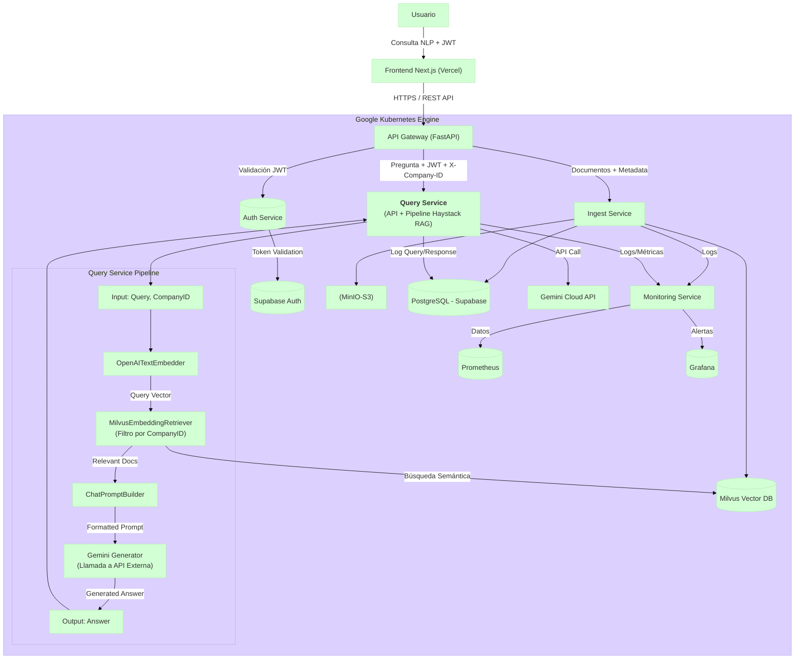

# Query Service (Microservicio de Consulta) - Plan de Desarrollo

## 1. Visión General

El **Query Service** es el microservicio responsable de manejar las consultas en lenguaje natural de los usuarios dentro de la plataforma SaaS B2B. Su función principal es recibir una pregunta, utilizar un **pipeline de Retrieval-Augmented Generation (RAG) construido con [Haystack](https://haystack.deepset.ai/)** para encontrar información relevante en los documentos previamente ingeridos (y almacenados en Milvus), generar una respuesta coherente utilizando un Large Language Model (LLM) como Gemini, y registrar la interacción.

**Flujo principal:**

1.  **Recepción:** La API recibe la consulta del usuario y el `X-Company-ID` (`POST /api/v1/query`).
2.  **Validación:** Verifica la consulta y el header `X-Company-ID`.
3.  **Procesamiento RAG (Pipeline Haystack):**
    *   **Embedding de Consulta:** Convierte la pregunta del usuario en un vector de embedding usando un modelo compatible (ej: `text-embedding-3-small` de **OpenAI**) a través de `OpenAITextEmbedder`.
    *   **Recuperación (Retrieval):** Busca en la base de datos vectorial **Milvus** los chunks de documentos más relevantes semánticamente para el embedding de la consulta, **filtrando estrictamente por el `company_id`** del usuario. Utiliza `MilvusEmbeddingRetriever` (o `MilvusHybridRetriever` si se implementa la ingesta híbrida).
    *   **Construcción del Prompt:** Combina la consulta original y el contenido de los documentos recuperados en un prompt estructurado para el LLM, usando `ChatPromptBuilder`.
    *   **Generación de Respuesta:** Envía el prompt al LLM configurado (ej: **Gemini API**) para generar la respuesta. Esto se puede hacer mediante una llamada directa a la API del LLM o encapsulándolo en un componente Haystack `Generator` (ej: un `GeminiGenerator` personalizado o adaptado).
4.  **Persistencia del Log:** Registra la consulta, la respuesta generada, los IDs de los documentos recuperados y metadatos relevantes en la tabla `QUERY_LOGS` de **Supabase (PostgreSQL)**.
5.  **Respuesta:** Devuelve la respuesta generada al usuario.

Este servicio se centra en la recuperación eficiente y la generación de respuestas contextualizadas, asegurando el aislamiento de datos entre empresas (multi-tenancy).

## 2. Arquitectura General del Proyecto (Posición del Query Service)

El `Query Service` (G1) interactúa principalmente con el API Gateway, Milvus, el LLM (Gemini) y Supabase.



*Nota: El pipeline RAG de Haystack se ejecuta **dentro** del `Query Service` (G1).*

## 3. Características Clave

*   **API RESTful:** Endpoint para recibir consultas y devolver respuestas.
*   **Pipeline RAG con Haystack:** Orquesta el embedding de la consulta, la recuperación filtrada de documentos relevantes desde Milvus y la generación de respuestas con un LLM.
*   **Integración con LLM:** Diseñado para interactuar con la API de Gemini (u otro LLM configurado).
*   **Multi-tenancy Estricto:** Asegura que las búsquedas y respuestas se basen únicamente en documentos pertenecientes a la empresa del usuario (`X-Company-ID`).
*   **Logging de Consultas:** Persistencia de interacciones en Supabase (PostgreSQL) para auditoría y análisis.
*   **Configuración Centralizada:** Uso de ConfigMaps y Secrets en Kubernetes.
*   **Logging Estructurado:** Logs en JSON con `structlog`.
*   **Basado en Estructura Existente:** Sigue el patrón de diseño y estructura del `ingest-service`.

## 4. Pila Tecnológica Principal

*   **Lenguaje:** Python 3.10+
*   **Framework API:** FastAPI
*   **Orquestación RAG:** Haystack AI 2.x
*   **Base de Datos Relacional (Logging):** Supabase (PostgreSQL) vía `asyncpg`.
*   **Base de Datos Vectorial (Retrieval):** Milvus vía `milvus-haystack`.
*   **Modelo de Embeddings (Query):** OpenAI (`text-embedding-3-small` por defecto) vía `haystack-ai`.
*   **Modelo de Lenguaje Grande (Generación):** Google Gemini (acceso vía API externa, ej: `google-generativeai`).
*   **Despliegue:** Docker, Kubernetes (GKE / local en K8s de Docker Desktop).

## 5. Estructura de la Codebase Propuesta.

Siguiendo el patrón del `ingest-service`:

```
query-service/
├── app/
│   ├── __init__.py
│   ├── api/
│   │   ├── __init__.py
│   │   └── v1/
│   │       ├── __init__.py
│   │       ├── endpoints/
│   │       │   ├── __init__.py
│   │       │   └── query.py      # Define el endpoint POST /query
│   │       └── schemas.py        # Define QueryRequest, QueryResponse, etc.
│   ├── core/
│   │   ├── __init__.py
│   │   ├── config.py         # Carga y valida la configuración (variables de entorno)
│   │   └── logging_config.py # Configura el logging (puede ser compartido/adaptado)
│   ├── db/
│   │   ├── __init__.py
│   │   └── postgres_client.py # Cliente para Supabase (logging) (puede ser compartido/adaptado)
│   ├── main.py               # Punto de entrada de la aplicación FastAPI
│   ├── models/               # (Opcional si no hay modelos de dominio específicos aquí)
│   │   └── __init__.py
│   ├── pipelines/            # Directorio para la lógica del pipeline Haystack
│   │   ├── __init__.py
│   │   └── rag_pipeline.py   # Define y construye el pipeline RAG de Haystack
│   ├── services/             # Para clientes de servicios externos
│   │   ├── __init__.py
│   │   ├── base_client.py    # (Reutilizable)
│   │   └── gemini_client.py  # (Opcional) Cliente específico para Gemini si no se usa un Generator Haystack
│   └── utils/
│       ├── __init__.py
│       └── helpers.py        # Funciones de utilidad
├── Dockerfile
├── pyproject.toml
├── README.md
└── .env.example
```

## 6. Configuración (Kubernetes)

Se necesitará un ConfigMap `query-service-config` y un Secret `query-service-secrets` en el namespace `nyro-develop`.

### ConfigMap (`query-service-config`)

| Clave                           | Descripción                                                          | Ejemplo (Valor Esperado)                        | Origen/Notas                                     |
| :------------------------------ | :------------------------------------------------------------------- | :---------------------------------------------- | :----------------------------------------------- |
| `QUERY_LOG_LEVEL`               | Nivel de logging.                                                    | `INFO`                                          | Similar a Ingest                                 |
| `QUERY_POSTGRES_SERVER`         | Host del **Supabase Session Pooler**.                                | `aws-0-sa-east-1.pooler.supabase.com`           | Igual que Ingest                                 |
| `QUERY_POSTGRES_PORT`           | Puerto del **Supabase Session Pooler**.                              | `5432`                                          | Igual que Ingest                                 |
| `QUERY_POSTGRES_USER`           | Usuario del **Supabase Session Pooler**.                             | `postgres.ymsilkrhstwxikjiqqog`                 | Igual que Ingest                                 |
| `QUERY_POSTGRES_DB`             | Base de datos en Supabase.                                           | `postgres`                                      | Igual que Ingest                                 |
| `QUERY_MILVUS_URI`              | URI del servicio Milvus dentro de K8s.                               | `http://milvus-service...:19530`                | Igual que Ingest                                 |
| `QUERY_MILVUS_COLLECTION_NAME`  | Nombre de la colección Milvus donde están los chunks.                | `document_chunks_haystack`                      | Igual que Ingest                                 |
| `QUERY_MILVUS_EMBEDDING_FIELD`  | Nombre del campo de embedding en Milvus.                             | `embedding`                                     | Igual que Ingest (Settings.MILVUS\_EMBEDDING\_FIELD) |
| `QUERY_MILVUS_CONTENT_FIELD`    | Nombre del campo de contenido en Milvus.                             | `content`                                       | Igual que Ingest (Settings.MILVUS\_CONTENT\_FIELD)   |
| `QUERY_OPENAI_EMBEDDING_MODEL`  | Modelo de embedding OpenAI para la *consulta*.                       | `text-embedding-3-small`                        | **Debe coincidir** con el usado en Ingest        |
| `QUERY_EMBEDDING_DIMENSION`     | Dimensión del vector de embedding.                                   | `1536`                                          | **Debe coincidir** con el usado en Ingest        |
| `QUERY_RETRIEVER_TOP_K`         | Número de documentos a recuperar de Milvus.                          | `5`                                             | Ajustable según rendimiento/precisión            |
| `QUERY_GEMINI_MODEL_NAME`       | Nombre del modelo Gemini a usar.                                     | `gemini-1.5-flash-latest`                       | (o el modelo específico de Gemini elegido)       |
| `QUERY_RAG_PROMPT_TEMPLATE`     | (Opcional) Plantilla Jinja2 para el prompt RAG (si no hardcodeada). | `"Responde a la pregunta '{{query}}' basándote únicamente en estos documentos:\n\n{{ doc.content }}\n"` | Puede definirse en código o aquí                |
| `QUERY_MAX_PROMPT_TOKENS`       | (Opcional) Límite de tokens para el prompt enviado a Gemini.         | `7000`                                          | Para evitar exceder límites de Gemini            |

### Secret (`query-service-secrets`)

| Clave del Secreto     | Variable de Entorno Correspondiente | Descripción                                   | Origen/Notas       |
| :-------------------- | :---------------------------------- | :-------------------------------------------- | :----------------- |
| `postgres-password`   | `QUERY_POSTGRES_PASSWORD`           | Contraseña de Supabase (Pooler).              | Misma que Ingest   |
| `openai-api-key`      | `QUERY_OPENAI_API_KEY`              | Clave API de OpenAI (para embedding consulta). | Misma que Ingest   |
| `gemini-api-key`      | `QUERY_GEMINI_API_KEY`              | Clave API para Google Gemini.                 | Nueva credencial   |

## 7. API Endpoints

Prefijo base: `/api/v1`

---

### Health Check

*   **Endpoint:** `GET /`
*   **Descripción:** Verifica la disponibilidad del servicio y la conexión a dependencias críticas (Supabase, Milvus - opcionalmente un ping). Usado por Kubernetes Probes.
*   **Respuesta Exitosa (`200 OK`):**
    ```json
    {
      "status": "ok",
      "service": "Query Service",
      "ready": true,
      "dependencies": {
          "supabase_connection": "ok",
          "milvus_connection": "ok" // o "pending" / "error"
      }
    }
    ```
*   **Respuesta No Listo (`503 Service Unavailable`):** Indica fallo en el arranque o pérdida de conexión a dependencias.
    ```json
    { "detail": "Service is not ready or dependencies unavailable." }
    ```

---

### Realizar Consulta (RAG)

*   **Endpoint:** `POST /query`
*   **Descripción:** Recibe una consulta, ejecuta el pipeline RAG y devuelve la respuesta generada por el LLM.
*   **Headers Requeridos:**
    *   `X-Company-ID`: (String UUID) Identificador de la empresa para filtrar documentos.
    *   `Authorization`: (String) `Bearer <JWT_TOKEN>` (Validado por API Gateway/Auth Service).
*   **Request Body:** (JSON)
    ```json
    {
      "query": "string" // La pregunta del usuario
      // "chat_history": [ { "role": "user/assistant", "content": "..." } ] // Opcional para conversaciones
      // "retriever_top_k": int // Opcional para sobreescribir el default
    }
    ```
    *   **Schema Pydantic:** `QueryRequest`
*   **Respuesta Exitosa (`200 OK`):**
    ```json
    {
      "answer": "string", // La respuesta generada por el LLM
      "retrieved_documents": [ // Lista de documentos usados como contexto
        {
          "id": "chunk_id_from_milvus_or_doc_id", // ID del chunk o documento
          "score": 0.85, // Score de relevancia del retriever
          "content_preview": "string" // (Opcional) Primeras N palabras/caracteres del chunk
          // "metadata": { ... } // (Opcional) Metadatos relevantes del chunk
        }
      ],
      "query_log_id": "uuid" // ID del registro en la tabla QUERY_LOGS
    }
    ```
    *   **Schema Pydantic:** `QueryResponse`
*   **Respuestas de Error:**
    *   `400 Bad Request`: Falta `query` o formato inválido.
    *   `401 Unauthorized`: Falta `X-Company-ID` o token inválido (detectado antes usualmente).
    *   `403 Forbidden`: El `X-Company-ID` no es válido o no tiene permisos.
    *   `404 Not Found`: (Potencialmente) Si no se encuentran documentos relevantes *y* el LLM no puede responder sin contexto (configurable).
    *   `500 Internal Server Error`: Fallo inesperado en el pipeline, LLM, o base de datos.
    *   `503 Service Unavailable`: Milvus, Supabase o Gemini no están disponibles.

## 8. Dependencias Externas Clave (Desde la perspectiva del Query Service)

*   **Supabase (PostgreSQL):** Almacenamiento de logs de consulta (`QUERY_LOGS`). Conectado vía **Session Pooler**.
*   **Milvus:** Base de datos vectorial para la recuperación de chunks de documentos relevantes. Conectado vía URI del servicio K8s (`http://milvus-service...`).
*   **OpenAI API:** Generación de embeddings para la consulta del usuario. Acceso vía Internet.
*   **Google Gemini API:** Generación de la respuesta final basada en el prompt RAG. Acceso vía Internet.
*   **API Gateway:** Recibe las peticiones del frontend/usuario.
*   **Auth Service (Implícito):** Valida el JWT antes de que la petición llegue al Query Service.

## 9. Pipeline Haystack Propuesto (`rag_pipeline.py`)

El pipeline RAG se construirá usando Haystack 2.x y componentes específicos:

1.  **Input:** Recibe `query` (string) y `company_id` (string UUID).
2.  **`OpenAITextEmbedder`:**
    *   Configurado con `settings.QUERY_OPENAI_EMBEDDING_MODEL`.
    *   Input: `text` (la consulta del usuario).
    *   Output: `embedding` (el vector de la consulta).
3.  **`MilvusEmbeddingRetriever`:**
    *   Configurado con `MilvusDocumentStore` apuntando a `settings.QUERY_MILVUS_URI`, `settings.QUERY_MILVUS_COLLECTION_NAME`, etc.
    *   Input: `query_embedding` (del `OpenAITextEmbedder`).
    *   Input (Dinámico): `filters` (diccionario para filtrar metadatos en Milvus). **Es CRUCIAL pasar aquí `{"company_id": company_id}`**.
    *   Input (Dinámico/Config): `top_k` (de `settings.QUERY_RETRIEVER_TOP_K` o request).
    *   Output: `documents` (lista de objetos `Document` de Haystack recuperados de Milvus).
4.  **`ChatPromptBuilder`:**
    *   Configurado con una plantilla Jinja2 (desde `settings.QUERY_RAG_PROMPT_TEMPLATE` o hardcodeada). La plantilla debe iterar sobre `documents` y usar `query`.
    *   Input: `query` (la consulta original).
    *   Input: `documents` (la lista de documentos del `MilvusEmbeddingRetriever`).
    *   Output: `prompt` (una lista de `ChatMessage` o un string formateado, dependiendo de cómo se integre Gemini).
5.  **Componente Generador (Gemini):**
    *   **Opción A (Recomendada si existe/es fácil crear):** Un componente `GeminiGenerator` personalizado de Haystack.
        *   Input: `prompt` (del `ChatPromptBuilder`).
        *   Lógica interna: Llama a la API de Gemini con el prompt, maneja la respuesta.
        *   Output: `replies` (lista de strings con las respuestas generadas).
    *   **Opción B (Alternativa):** Un componente `PythonFunction` de Haystack que encapsule la lógica de llamar a la API de Gemini.
        *   Input: `prompt`.
        *   Lógica: Usa la librería `google-generativeai` para enviar el prompt y obtener la respuesta.
        *   Output: `replies`.
    *   **Opción C (Menos Haystack-native):** El endpoint FastAPI llama directamente a un `GeminiClient` después de recibir los documentos del retriever y construir el prompt manualmente (sin `ChatPromptBuilder` ni `Generator` de Haystack para este paso). Menos elegante pero funcional.
6.  **Output:** La respuesta final (`replies`) del componente Generador.

**Conexiones del Pipeline (Ejemplo):**

```python
# En app/pipelines/rag_pipeline.py

from haystack import Pipeline
from haystack.components.embedders import OpenAITextEmbedder
from milvus_haystack import MilvusDocumentStore, MilvusEmbeddingRetriever
from haystack.components.builders.chat_prompt_builder import ChatPromptBuilder
# from app.components.generators import GeminiGenerator # Si se crea un componente custom
# from haystack.components.generators.chat import OpenAIChatGenerator # Ejemplo, reemplazar con Gemini
# from app.services.gemini_client import call_gemini_api # Si se usa opción B/C

# ... inicializar componentes (store, embedder, retriever, builder, generator/client) ...

rag_pipeline = Pipeline()

rag_pipeline.add_component("text_embedder", ...) # OpenAITextEmbedder instance
rag_pipeline.add_component("retriever", ...)     # MilvusEmbeddingRetriever instance
rag_pipeline.add_component("prompt_builder", ...) # ChatPromptBuilder instance
rag_pipeline.add_component("llm_generator", ...) # GeminiGenerator or similar

# Conectar los componentes
rag_pipeline.connect("text_embedder.embedding", "retriever.query_embedding")
rag_pipeline.connect("retriever.documents", "prompt_builder.documents")
rag_pipeline.connect("prompt_builder.prompt", "llm_generator.prompt") # Ajustar según output/input

# Inputs esperados por pipeline.run():
# {
#   "text_embedder": {"text": user_query},
#   "retriever": {"filters": {"company_id": company_id_str}, "top_k": 5},
#   "prompt_builder": {"query": user_query}
# }
# Output de pipeline.run():
# {
#   "llm_generator": {"replies": ["Generated answer..."]}
# }
```

## 10. Consideraciones Adicionales

*   **Manejo de Errores:** Implementar manejo robusto para fallos en Milvus, Supabase, OpenAI, Gemini API. Devolver códigos de estado y mensajes claros.
*   **Gestión de Contexto Largo:** Si los `top_k` documentos recuperados exceden el límite de tokens del prompt de Gemini, se necesita una estrategia (truncar, resumir, seleccionar los más relevantes por score).
*   **Prompt Engineering:** La calidad de la plantilla del `ChatPromptBuilder` es crucial para obtener buenas respuestas del LLM. Debe instruir claramente al modelo para que use *solo* la información proporcionada.
*   **Seguridad:** Validar estrictamente el `X-Company-ID`. Asegurar que las API keys (OpenAI, Gemini) se manejen como Secrets.
*   **Rendimiento:** Optimizar la configuración de Milvus (índices), ajustar `top_k`, y considerar `AsyncPipeline` de Haystack si hay cuellos de botella paralelizables (aunque el flujo RAG es bastante secuencial). Monitorear latencias.
*   **Logging Detallado:** Además del log de `QUERY_LOGS`, usar `structlog` para trazar el flujo de la petición a través del pipeline Haystack, incluyendo scores de retriever, prompt final, etc., para depuración.
*   **Integración con Gemini:** Investigar la mejor forma de integrar Gemini: SDK directo, un `Generator` de Haystack existente (si es compatible con llamadas genéricas a APIs) o crear un componente `GeminiGenerator` personalizado.

## 11. TODO / Mejoras Futuras

*   **Implementar Logging:** Escribir la lógica para insertar en la tabla `QUERY_LOGS` de Supabase.
*   **Integración Gemini:** Finalizar la implementación de la llamada a la API de Gemini (Opción A, B o C).
*   **Tests:** Añadir tests unitarios (para lógica de componentes, formateo) y de integración (simulando llamadas a Milvus/Gemini, verificando el flujo completo).
*   **Observabilidad:** Integrar tracing distribuido (OpenTelemetry) para seguir las peticiones a través de los servicios.
*   **Manejo de Chat History:** Implementar la recepción y uso del historial de chat en el `QueryRequest` para mantener conversaciones contextualizadas. El `ChatPromptBuilder` puede manejar esto.
*   **Evaluación de Calidad RAG:** Implementar mecanismos para evaluar la calidad de las respuestas (precisión, relevancia, ausencia de alucinaciones).
*   **Soporte Híbrido/Sparse:** Si `ingest-service` añade embeddings sparse/híbridos, actualizar el retriever aquí (`MilvusHybridRetriever`, `MilvusSparseEmbeddingRetriever`).
*   **Mecanismo de Feedback:** Añadir endpoints para que los usuarios puedan calificar las respuestas (útil para mejorar el sistema).

---

Este documento proporciona una base sólida para comenzar el desarrollo del `query-service`. Si necesitas detalles más específicos sobre alguna sección (por ejemplo, la implementación exacta de la llamada a Gemini o la estructura de `QUERY_LOGS`), por favor, solicítalo.